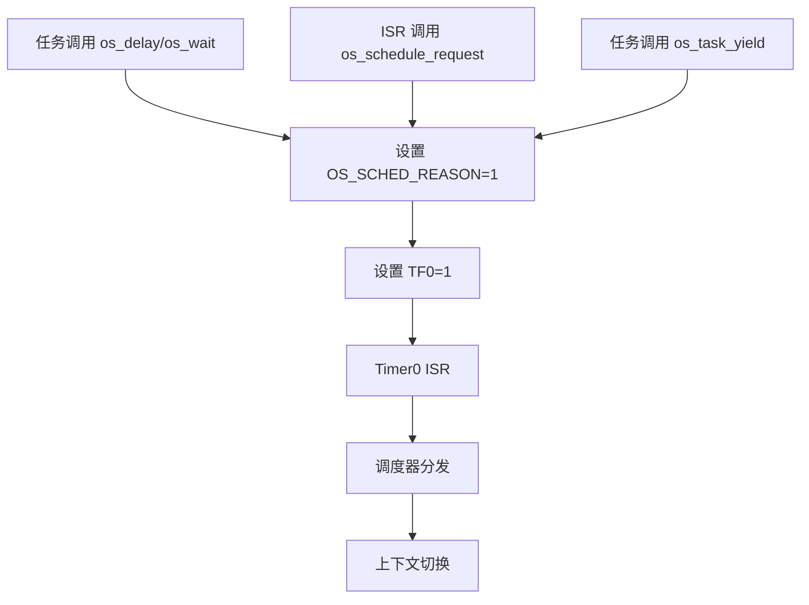
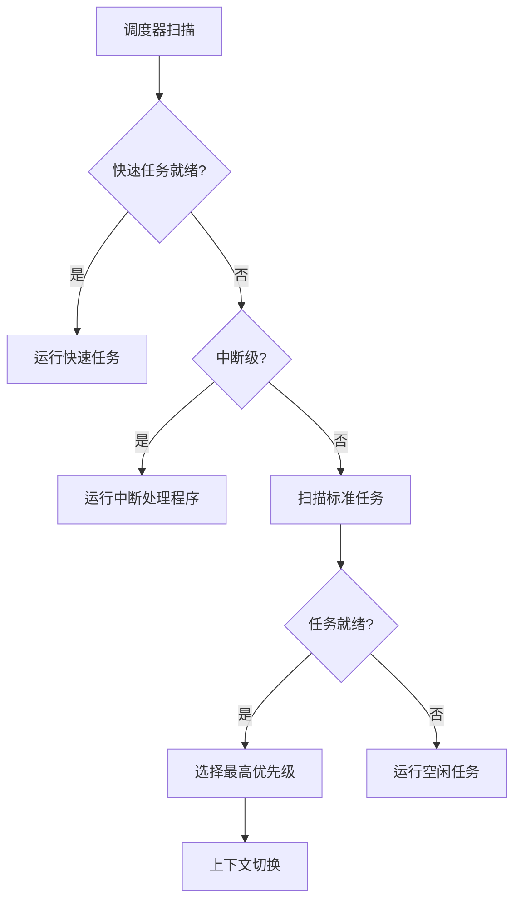

# HRTOS 调度器设计

## 模块介绍

HRTOS 调度器负责选择在 CPU 上运行的任务。它实现了基于优先级的抢占式调度算法，具有可选的时间片模式，旨在满足 8051 微控制器的实时要求。

## 主要职责

调度器处理：

- 基于优先级的任务选择
- 抢占式任务切换
- 时间片管理
- 快速任务调度
- 中断级任务处理
- 调度器模式切换（HRTOS vs MYOS）

## 主要文件

### 源文件

- `Src/kernel/scheduler.c`：调度器模式选择
- `Src/kernel/scheduler_dispatch.c`：任务分发机制
- `Src/kernel/scheduler_mode.c`：调度模式配置
- `Src/kernel/task_create.c`：任务注册（设置调度信息）
- `Src/task/task_scheduler.c`：任务调度逻辑
- `Src/task/task_yield.c`：自愿 CPU 让出
- `Src/interrupt/schedule_request.c`：来自 ISR 的调度请求

### 头文件

- `Inc/kernel.h`：调度器 API 声明
- `Inc/config.h`：调度级别定义
- `Inc/hrtos_internal.h`：内部调度器变量

## 数据结构

### 调度级别定义

位于 `Inc/config.h`：

```c
/* 调度级别定义：
* 0-7   普通任务优先级
* 8     高优先级任务
* 9     中断级
* 10    中断嵌套级
*/
#define OS_SCHED_LEVEL_MAX 10
```

### 任务调度信息

位于 `Src/kernel/os_core.c`：

```c
volatile unsigned char idata OS_CURRENT_TASK;   /* 当前运行任务 */
volatile unsigned char idata OS_PREV_TASK;      /* 前一个任务 */
volatile unsigned char idata OS_TIME_XY;        /* 当前时间片 */
volatile unsigned char idata OS_DISPATCH_ID;     /* 分发触发源 */
volatile unsigned char xdata OS_TIME_ONCE;       /* 时间片计数 */
```

### 任务状态数组

```c
volatile unsigned char xdata OS_PROCESS_OK[OS_PROCESS_MAX];
/* 格式：位 0：状态，位 1-3：优先级，位 4-7：栈大小 */
```

### 快速任务标志

```c
volatile bit OS_KUAI_PROCESS_A;  /* 快速任务 0 激活 */
volatile bit OS_KUAI_PROCESS_B;  /* 快速任务 1 激活 */
```

## 核心函数

### os_set_scheduler()

**位置**：`Src/kernel/scheduler.c`

**目的**：在 HRTOS 和 MYOS 调度模式之间切换

**参数**：
- `id`：1 表示 HRTOS 模式，0 表示 MYOS 模式

**返回**：成功返回 1，失败返回 -1

**逻辑**：
```c
char os_set_scheduler(unsigned char id)
{
    if((id==0)&&(OS_INTERRUPT_T0==0))  // 切换到 MYOS
    {
        OS_INTERRUPT_T0=1;
        OS_TIME_ONCE_BACKUP=OS_TIME_ONCE;
        return 1;
    }
    else if((id==1)&&(OS_INTERRUPT_T0==1))  // 切换到 HRTOS
    {
        OS_INTERRUPT_T0=0;
        OS_TIME_XY=OS_TIME_XY+OS_TIME_ONCE_BACKUP-OS_TIME_ONCE;
        OS_TIME_ONCE=OS_TIME_ONCE_BACKUP;
        return 1;
    }
    return -1;
}
```

### os_scheduler_mode_switch()

**位置**：`Src/kernel/scheduler_mode.c`

**目的**：在实时和通用调度模式之间切换

**参数**：
- `id`：1 表示实时模式，0 表示通用模式

### os_schedule_request()

**位置**：`Src/interrupt/schedule_request.c`

**目的**：通过触发 Timer0 中断请求立即重新调度

**逻辑**：
```c
char os_schedule_request(char id)
{
    id = id;                    /* 保留供将来使用 */
    OS_SCHED_REASON=1;          /* 设置调度触发标志 */
    TF0=1;                      /* 触发 Timer0 中断 */
    return 1;
}
```

### os_task_yield()

**位置**：`Src/task/task_yield.c`

**目的**：自愿将 CPU 让给相同优先级的其他任务

**实现**：设置调度触发并强制上下文切换

## 调用关系

### 调度触发流程



### 优先级选择流程



## 生命周期

### 调度器初始化

1. 系统启动进入 `os_idle_task()`
2. `OS_TIME_XY` 初始化为时间片计数
3. `OS_CURRENT_TASK` 设置为 0（空闲）
4. `OS_SCHED_REASON` 清除
5. 启用中断
6. Timer0 开始生成时钟周期

### 调度周期

1. **时钟中断**：Timer0 ISR 触发
2. **时间片递减**：`OS_TIME_XY++`
3. **时间片检查**：如果 `OS_TIME_XY == OS_TIME_ONCE`，触发调度
4. **优先级扫描**：从最高到最低优先级扫描任务
5. **任务选择**：选择最高优先级的就绪任务
6. **上下文切换**：保存当前任务，恢复选定任务
7. **执行**：选定的任务运行

### 快速任务调度

快速任务（优先级 8）有特殊处理：

- 使用专用上下文保存区域
- 具有独立的延时计数器（`OS_WAIT_DI2`）
- 可以抢占标准任务
- 最小上下文保存（5 个寄存器 vs 标准任务的 13 个）

## 设计原则

### 基于优先级的抢占

- 高优先级任务总是抢占低优先级任务
- 标准任务的优先级级别 0-7
- 快速任务的优先级级别 8
- 中断处理程序的优先级级别 9-10

### 时间片模式

- 可配置的时间片计数（`OS_TIME_ONCE`）
- 可配置的时钟周期持续时间（`OS_TIME_T0`）
- 相同优先级任务的时间片相等
- 可以禁用时间片以进行纯优先级调度

### 快速任务优化

- 减少上下文保存深度
- 独立的延时机制
- 专用寄存器组
- 最小调度开销

### 双调度器支持

- HRTOS 模式：基于优先级，带时间片
- MYOS 模式：替代调度算法
- 通过 `os_set_scheduler()` 运行时切换

## 约束

- 最多 10 个优先级级别
- 最多 16 个标准任务
- 最多 2 个快速任务
- 快速任务不能使用标准等待机制
- 优先级继承仅适用于互斥锁（不适用于调度器）
- 没有时间片时相同优先级内没有轮询

## 调度算法

### 就绪队列选择

调度器按优先级顺序扫描任务：

1. 检查快速任务（优先级 8）
2. 检查中断处理程序（优先级 9-10）
3. 扫描标准任务（优先级 0-7）
4. 回退到空闲任务

### 任务状态位

`OS_PROCESS_OK[id]` 编码：

- 位 0：就绪标志（1 = 就绪，0 = 未就绪）
- 位 1-3：优先级级别
- 位 4-7：栈大小

### 上下文切换触发

调度在以下情况下触发：

- 时间片到期（`OS_TIME_XY == OS_TIME_ONCE`）
- 任务自愿让出（`os_task_yield()`）
- 任务在 IPC 上阻塞（`os_wait()`）
- ISR 请求调度（`os_schedule_request()`）
- 任务唤醒（`wake_task()`）

## 性能考虑

### 关键路径优化

- 快速任务最小化上下文保存
- 优先级扫描使用简单线性搜索
- ISR 中的时间片递减
- 就绪队列无复杂数据结构

### 内存效率

- 无单独的就绪队列数据结构
- 任务状态编码在单字节中
- 快速任务使用专用的小上下文区域
- 栈分配的位图

### 实时保证

- 确定性优先级选择
- 有界上下文切换时间
- 无优先级反转（互斥锁情况单独处理）
- 快速任务响应时间
