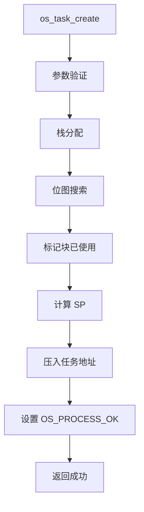
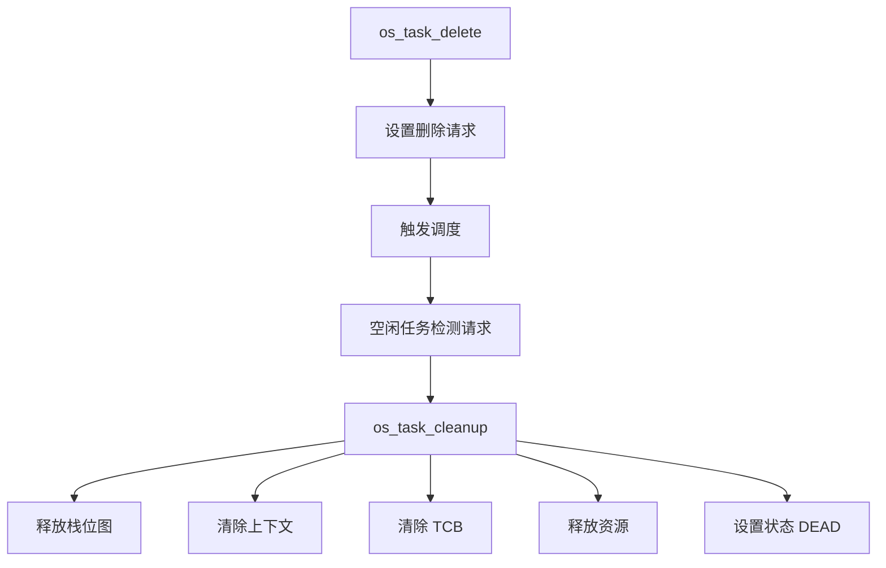
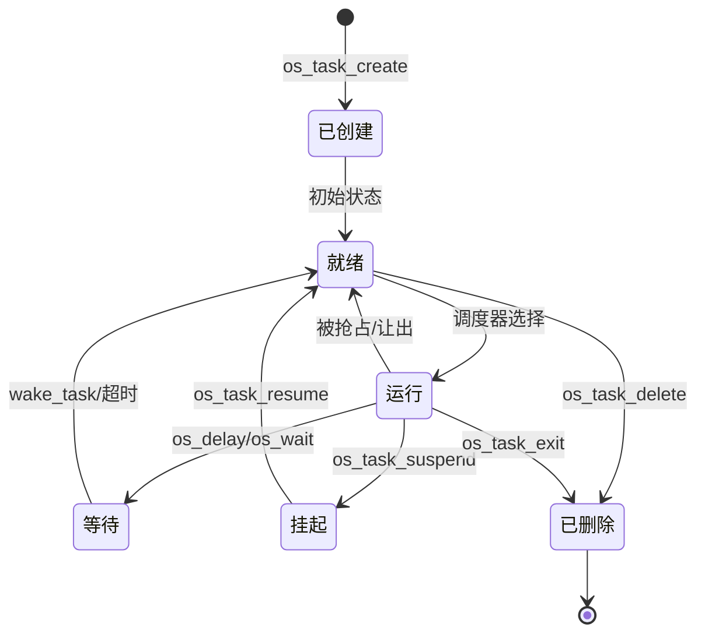

# HRTOS 任务管理

## 模块介绍

任务管理是 HRTOS 的核心，负责创建、控制和管理并发任务的生命周期。它处理任务注册、状态转换、优先级管理和资源清理。

## 主要职责

任务管理处理：

- 任务创建和注册
- 任务状态转换（就绪、运行、等待、挂起、删除）
- 任务优先级管理
- 任务删除和清理
- 任务挂起和恢复
- 栈分配和管理
- 上下文保存/恢复协调

## 主要文件

### 源文件

- `Src/kernel/task_create.c`：任务创建和注册
- `Src/kernel/task_cleanup.c`：任务清理和资源释放
- `Src/task/task_delete.c`：任务删除
- `Src/task/task_exit.c`：当前任务退出
- `Src/task/task_is_valid.c`：任务有效性检查
- `Src/task/task_resume.c`：恢复挂起的任务
- `Src/task/task_scheduler.c`：任务调度逻辑
- `Src/task/task_self.c`：获取当前任务 ID
- `Src/task/task_state.c`：查询任务状态
- `Src/task/task_suspend.c`：挂起任务
- `Src/task/task_suspend_self.c`：自挂起
- `Src/task/task_yield.c`：让出 CPU
- `Src/task_priority/task_get_priority.c`：获取任务优先级
- `Src/task_priority/task_set_priority.c`：设置任务优先级
- `Src/task_priority/lock.c`：锁定任务创建
- `Src/task_priority/unlock.c`：解锁任务创建
- `Src/task_priority/lock_query.c`：查询任务创建锁定状态

### 头文件

- `Inc/task.h`：任务管理 API 声明
- `Inc/config.h`：任务配置和 TCB 定义
- `Inc/hrtos_internal.h`：内部任务管理变量

## 数据结构

### OS_TCB（任务控制块）

位于 `Inc/config.h`：

```c
typedef struct {
    u8 id;              /* 任务 ID */
    u8 base_prio;       /* 静态优先级 */
    u8 cur_prio;        /* 动态优先级 */
    u8 state;           /* 任务状态 */
    u8 wait_type;       /* 等待类型 */
    u8 wait_flag;       /* 等待结果标志 */
    u8 wait_obj;        /* 等待对象 ID */
    u16 wait_tick;      /* 超时时钟周期 */
} OS_TCB;
```

### 任务状态数组

位于 `Src/kernel/os_core.c`：

```c
volatile unsigned char xdata OS_PROCESS_OK[OS_PROCESS_MAX];
/* 编码：
 * 位 0：就绪标志（1 = 可运行）
 * 位 1-3：优先级级别
 * 位 4-7：栈大小
 */
```

### 栈指针

```c
volatile unsigned char xdata OS_JINCHENG_SP[OS_PROCESS_MAX];      /* 当前 SP */
volatile unsigned char xdata OS_JINCHENG_JILU_SP[OS_PROCESS_MAX];  /* 初始 SP */
```

### 上下文保存区域

```c
volatile unsigned char xdata OS_TASK_CONTEXT[OS_PROCESS_MAX][OS_JINCHENG_SHENDU];
/* 标准任务上下文：每个任务 13 个寄存器 */

volatile unsigned char xdata OS_FAST_CONTEXT[OS_FAST_TASK_MAX][OS_KUAI_SHENDU];
/* 快速任务上下文：每个任务 5 个寄存器 */
```

### 快速任务控制

```c
volatile bit OS_KUAI_PROCESS_A;  /* 快速任务 0 激活 */
volatile bit OS_KUAI_PROCESS_B;  /* 快速任务 1 激活 */
volatile unsigned char xdata OS_KUAI_SP[OS_FAST_TASK_MAX];
volatile unsigned char xdata OS_SP_KUAI_BEI[OS_FAST_TASK_MAX];
volatile unsigned char xdata OS_SP_KUAI_BEI2[OS_FAST_TASK_MAX];
```

## 核心函数

### os_task_create()

**位置**：`Src/kernel/task_create.c`

**目的**：创建并注册新任务

**参数**：
- `addr`：任务函数地址
- `id`：任务 ID（标准任务为 0-15，快速任务为 16-17）
- `pr`：优先级级别（0-10）
- `sd`：栈深度（层数）

**返回**：成功返回 1，失败返回 -1

**过程**：
1. 验证参数（优先级、ID、地址）
2. 检查重复注册
3. 使用位图搜索分配栈空间
4. 计算初始栈指针
5. 将任务地址压入栈
6. 在 `OS_PROCESS_OK` 中设置任务状态
7. 对于快速任务：设置激活标志和上下文
8. 对于中断处理程序：将地址存储在中断向量中

**栈分配算法**：
```c
// 基于位图的分配
for(i=0; i<(OS_USER_RAM_EXIT-OS_USER_RAM_INIT)/2; i++)
{
    x=i/8;                    // 位图字节索引
    OS_R0_PROTECT=i%8;        // 位位置
    x=OS_MEMORY[x]&(0x80>>OS_R0_PROTECT);
    if(x==0)                  // 找到空闲块
    {
        k++;                  // 计数连续空闲块
        if(k>=sd)             // 足够空间
        {
            // 标记块为已使用
            for(j=i-k+1; j<=i; j++)
            {
                x=j/8;
                OS_R0_PROTECT=j%8;
                OS_MEMORY[x]|=(0x80>>OS_R0_PROTECT);
            }
            goto OS_SLAB_001_; // 成功
        }
    }
    else
    {
        k=0;                  // 重置计数器
    }
}
```

### os_task_cleanup()

**位置**：`Src/kernel/task_cleanup.c`

**目的**：清理任务资源并释放栈

**参数**：
- `id`：要清理的任务 ID

**返回**：成功返回 1，失败返回 -1

**过程**：
1. 验证任务 ID
2. 检查任务是否存在
3. 计算栈块位置
4. 在位图中释放栈块
5. 清除上下文保存区域
6. 清除 `OS_PROCESS_OK` 中的任务状态
7. 清除 TCB 中的等待信息
8. 从资源等待队列中移除
9. 如果持有互斥锁则释放所有权
10. 将任务状态设置为 DEAD

### 任务状态函数

#### os_task_get_state()

**位置**：`Src/task/task_state.c`

**目的**：查询任务状态

**返回**：
- 0：已删除
- 1：运行中
- 2：就绪
- 3：挂起
- 4：先前切换出

**逻辑**：
```c
if(OS_PROCESS_OK[id]==0) return 0;      // 已删除
if(id==OS_CURRENT_TASK) return 1;       // 运行中
if(id==OS_PREV_TASK) return 4;          // 前一个
if(OS_PROCESS_OK[id]&0x01) return 2;    // 就绪
return 3;                               // 挂起
```

#### os_task_suspend()

**位置**：`Src/task/task_suspend.c`

**目的**：挂起任务（从调度中移除）

**过程**：清除 `OS_PROCESS_OK` 中的就绪标志

#### os_task_resume()

**位置**：`Src/task/task_resume.c`

**目的**：恢复挂起的任务

**过程**：设置 `OS_PROCESS_OK` 中的就绪标志

#### os_task_delete()

**位置**：`Src/task/task_delete.c`

**目的**：完全删除任务

**过程**：设置删除请求标志，空闲任务将清理

#### os_task_exit()

**位置**：`Src/task/task_exit.c`

**目的**：当前任务自行退出

**过程**：设置删除请求并触发调度

### 优先级管理

#### os_task_set_priority()

**位置**：`Src/task_priority/task_set_priority.c`

**目的**：更改任务优先级

**参数**：
- `id`：任务 ID
- `pr`：新优先级

**过程**：
1. 验证优先级范围
2. 锁定优先级更改
3. 更新 `OS_PROCESS_OK` 中的优先级
4. 更新 TCB 优先级字段
5. 解锁优先级更改
6. 如需要则触发重新调度

#### os_task_get_priority()

**位置**：`Src/task_priority/task_get_priority.c`

**目的**：获取当前任务优先级

**返回**：来自 `OS_PROCESS_OK` 的优先级值

## 调用关系

### 任务创建流程



### 任务删除流程



### 状态转换流程



## 生命周期

### 任务创建

1. **注册**：调用 `os_task_create()`
2. **分配**：通过位图分配栈空间
3. **初始化**：设置栈指针，压入地址
4. **状态设置**：配置 `OS_PROCESS_OK`
5. **就绪**：任务标记为可调度

### 任务执行

1. **选择**：调度器选择任务
2. **上下文恢复**：从保存区域加载上下文
3. **执行**：任务代码运行
4. **阻塞**：任务可能调用阻塞 API
5. **抢占**：高优先级任务可能抢占

### 任务删除

1. **请求**：调用 `os_task_delete()` 或 `os_task_exit()`
2. **标志**：设置删除请求标志
3. **检测**：空闲任务检测请求
4. **清理**：调用 `os_task_cleanup()`
5. **释放**：释放栈和资源
6. **最终**：任务状态设置为 DEAD

## 设计原则

### 静态分配

- 所有任务静态分配
- 任务创建无动态内存
- 通过位图预分配栈空间
- 最大任务数在编译时固定

### 基于优先级

- 优先级决定执行顺序
- 高优先级总是抢占低优先级
- 优先级可以在运行时更改
- 优先级继承的动态优先级

### 类型区分

- **标准任务**：完整上下文保存，优先级 0-7
- **快速任务**：最小上下文，优先级 8
- **中断处理程序**：直接地址映射，优先级 9-10

### 资源清理

- 删除时自动清理
- 清除资源等待队列
- 释放互斥锁所有权
- 释放栈空间

## 约束

- 最多 16 个标准任务（ID 0-15）
- 最多 2 个快速任务（ID 16-17）
- 优先级级别限制为 0-10
- 栈深度受限（标准任务最多 6，快速任务最多 25）
- 无递归任务创建
- 任务 0 保留给空闲任务
- 栈溢出检测有限

## 任务类型

### 标准任务

- ID：1-15（ID 0 是空闲）
- 优先级：0-7
- 栈深度：1-6 层
- 上下文：13 个寄存器（PWS、ACC、B、DPTR、寄存器组）
- 使用统一等待机制

### 快速任务

- ID：16-17
- 优先级：8
- 栈深度：1-25 层
- 上下文：5 个寄存器（PWS、ACC、B、DPTR）
- 独立延时机制（`OS_WAIT_DI2`）
- 不能使用标准等待

### 中断处理程序

- 优先级：9-10
- 无任务 ID
- 直接地址映射
- 在中断上下文中执行
- 无上下文保存（使用中断栈）

## 内存布局

### 栈分配

- 用户栈区域：0x42-0x7F（62 字节）
- 位图：XDATA 中 4 字节
- 块大小：每块 2 字节
- 最大块数：31 块

### 上下文保存区域

- 标准任务上下文：XDATA，每个任务 13 字节
- 快速任务上下文：XDATA，每个任务 5 字节
- 总上下文内存：208 字节（标准）+ 10 字节（快速）
