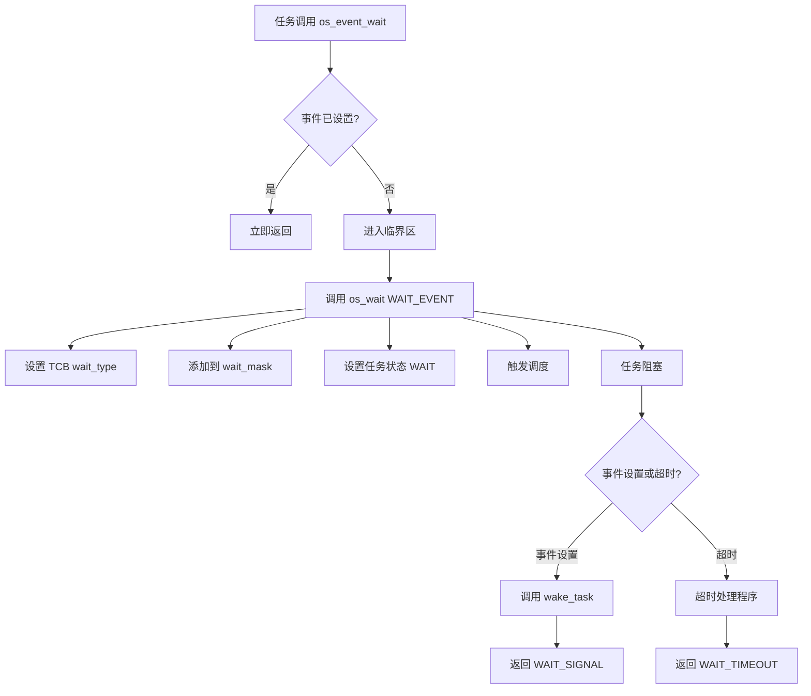
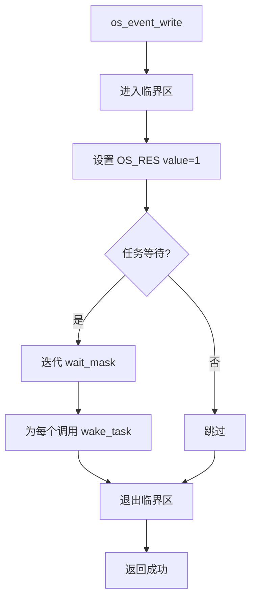
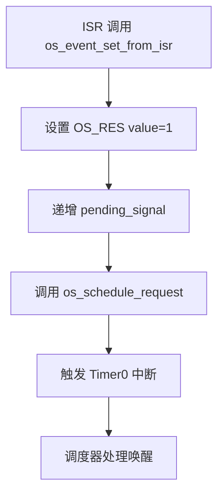

# HRTOS 事件设计

## 模块介绍

事件模块提供基于事件标志的任务协调轻量级同步机制。事件用于状态同步而不进行数据传输，允许任务等待特定条件发生。

## 主要职责

事件模块处理：

- 事件初始化和删除
- 事件标志设置（写入）
- 带超时的事件等待
- 事件状态查询
- ISR 安全事件操作

## 主要文件

### 源文件

- `Src/event/event_init.c`：事件初始化
- `Src/event/event_write.c`：事件标志设置
- `Src/event/event_wait.c`：事件等待
- `Src/event/event_query.c`：事件状态查询
- `Src/event/event_delete.c`：事件删除
- `Src/interrupt/event_set_from_isr.c`：ISR 安全的事件设置

### 头文件

- `Inc/event.h`：事件 API 声明
- `Inc/config.h`：事件类型定义
- `Inc/hrtos_internal.h`：内部事件变量

## 数据结构

### OS_RESOURCE（统一 IPC）

事件使用统一资源结构：

```c
typedef struct {
    u8 value;           /* 事件标志值 */
    u8 owner;           /* 事件不使用 */
    u8 wait_cnt;        /* 等待任务计数 */
    u16 wait_mask;      /* 位图等待队列 */
    u8 pending_signal;  /* ISR 信号计数 */
} OS_RESOURCE;
```

对于事件：
- `value`：事件标志（0 = 未设置，非零 = 已设置）
- `wait_mask`：等待此事件的任务位图
- `wait_cnt`：等待任务计数

### 事件位图

位于 `Inc/hrtos_internal.h`：

```c
extern unsigned int xdata OS_EVENT_BIT;    // 事件位操作
extern unsigned char xdata OS_TASK_EVENT[OS_PROCESS_MAX + OS_FAST_TASK_MAX];
```

## 核心函数

### os_event_init()

**位置**：`Src/event/event_init.c`

**目的**：初始化事件对象

**参数**：
- `obj`：资源 ID（0-7）

**返回**：成功返回 1，失败返回 -1

**过程**：
1. 验证资源 ID
2. 通过 `os_res_init()` 初始化资源结构
3. 将值设置为 0（事件未设置）
4. 清除等待队列

### os_event_write()

**位置**：`Src/event/event_write.c`

**目的**：设置事件标志（任务上下文）

**参数**：
- `id`：事件资源 ID

**返回**：成功返回 1，失败返回 -1

**过程**：
1. 验证资源 ID
2. 进入临界区
3. 将事件值设置为 1
4. 唤醒所有等待任务
5. 退出临界区

### os_event_wait()

**位置**：`Src/event/event_wait.c`

**目的**：等待事件被设置

**参数**：
- `obj`：事件资源 ID
- `tick`：超时时钟周期

**返回**：成功返回 1，失败返回 -1

**过程**：
```c
char os_event_wait(u8 obj, u16 tick)
{
    if(obj >= OS_RESOURCE_MAX) return -1;
    EA=0;
    /* 事件已设置，立即返回 */
    if(OS_RES[obj].value)
    {
        return 1;
    }
    EA=1;
    /* 否则进入等待 */
    return os_wait(WAIT_EVENT, obj, tick);
}
```

### os_event_query()

**位置**：`Src/event/event_query.c`

**目的**：查询事件状态而不阻塞

**参数**：
- `id`：事件资源 ID

**返回**：事件值（0 = 未设置，非零 = 已设置）

### os_event_delete()

**位置**：`Src/event/event_delete.c`

**目的**：删除事件对象

**参数**：
- `id`：事件资源 ID

**返回**：成功返回 1，失败返回 -1

**过程**：
1. 验证资源 ID
2. 清除资源结构
3. 以错误唤醒所有等待任务

### os_event_set_from_isr()

**位置**：`Src/interrupt/event_set_from_isr.c`

**目的**：ISR 安全的事件设置

**参数**：
- `id`：事件资源 ID

**返回**：成功返回 1，失败返回 -1

**过程**：
1. 验证资源 ID
2. 设置事件值
3. 递增挂起信号计数器
4. 触发调度请求

## 调用关系

### 事件等待流程



### 事件设置流程



### ISR 事件设置流程



## 生命周期

### 事件生命周期

1. **初始化**：`os_event_init()` 创建事件对象
2. **等待**：任务调用 `os_event_wait()` 阻塞
3. **设置**：`os_event_write()` 或 ISR 设置事件标志
4. **唤醒**：所有等待任务被唤醒
5. **自动重置**：事件标志保持设置（未实现手动重置）
6. **删除**：`os_event_delete()` 移除事件

## 设计原则

### 轻量级同步

- 无数据传输，仅状态通知
- 标志的单字节值
- 基于位图的等待队列
- 最小内存开销

### 广播唤醒

- 设置事件唤醒所有等待任务
- 无单任务唤醒模式
- 适用于"事件发生"通知

### ISR 安全

- 独立的 ISR 安全 API
- ISR 的挂起信号计数器
- 临界区保护
- 可从中断上下文安全调用

### 统一资源模型

- 与其他 IPC 使用相同的 `OS_RESOURCE` 结构
- 通过 `os_wait()` 统一等待机制
- 一致的 API 模式

## 约束

- 最多 8 个事件对象
- 无手动重置（未实现自动重置）
- 无 AND/OR 等待模式（仅单个事件）
- 仅广播唤醒（无选择性唤醒）
- 无事件数据负载
- 事件标志持续直到显式清除

## 使用模式

### 简单事件通知

```c
// 任务 A 等待事件
os_event_wait(EVENT_ID, OS_WAIT_FOREVER);

// 任务 B 或 ISR 设置事件
os_event_write(EVENT_ID);
```

### 超时等待

```c
// 带超时等待
result = os_event_wait(EVENT_ID, 100);
if (result == WAIT_TIMEOUT) {
    // 处理超时
}
```

### ISR 通知

```c
// 在 ISR 中
void external_interrupt_handler(void) {
    os_event_set_from_isr(EVENT_ID);
}
```

## 性能考虑

### 快速路径优化

- 事件已设置：立即返回而不阻塞
- 如果事件已设置则无上下文切换
- 仅标志修改的临界区

### 唤醒开销

- 事件设置时唤醒所有等待任务
- 每次唤醒需要上下文切换
- 如果许多任务等待可能导致惊群效应

### 内存效率

- 事件标志单字节
- 等待队列位图（2 字节）
- 无额外数据结构

## 与其他 IPC 的比较

### vs 信号量

- 事件：二进制标志，广播唤醒
- 信号量：计数，每次发布单个唤醒

### vs 消息队列

- 事件：无数据传输
- 消息队列：带队列的数据传输

### vs 互斥锁

- 事件：无所有权，无优先级继承
- 互斥锁：所有权，优先级继承
