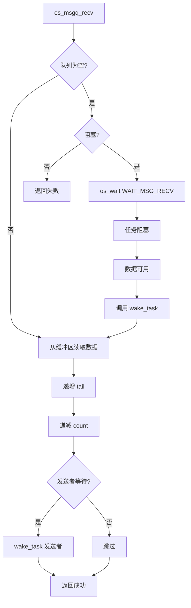
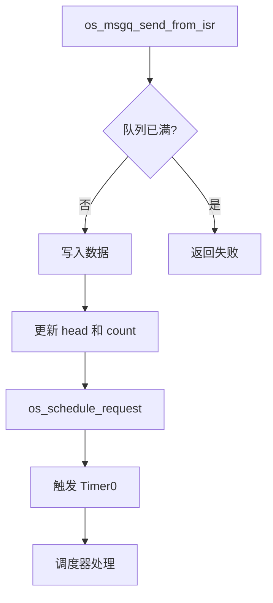

# HRTOS 消息队列设计

## 模块介绍

消息队列模块提供缓冲的任务间通信机制，用于在任务之间传递 1 字节消息。它实现具有生产者-消费者语义的循环缓冲区，支持阻塞和非阻塞模式。

## 主要职责

消息队列模块处理：

- 使用用户缓冲区初始化队列
- 消息发送（入队）
- 消息接收（出队）
- 队列清除
- ISR 安全消息发送
- 阻塞/非阻塞模式

## 主要文件

### 源文件

- `Src/msgq/msgq_init.c`：队列初始化
- `Src/msgq/msgq_send.c`：消息发送
- `Src/msgq/msgq_recv.c`：消息接收
- `Src/msgq/msgq_clear.c`：队列清除
- `Src/interrupt/msgq_send_from_isr.c`：ISR 安全消息发送
- `Src/interrupt/msgq_recv_from_isr.c`：ISR 安全消息接收
- `Src/interrupt/queue_send_from_isr.c`：ISR 安全队列发送（遗留）

### 头文件

- `Inc/msgq.h`：消息队列 API 声明
- `Inc/config.h`：消息队列结构定义
- `Inc/hrtos_internal.h`：内部队列变量

## 数据结构

### os_msgq_t（消息队列结构）

位于 `Inc/config.h`：

```c
typedef struct {
    u8 *buf;            /* 缓冲区指针 */
    u8 _size;           /* 缓冲区大小 */
    u8 head;            /* 写指针（生产者） */
    u8 tail;            /* 读指针（消费者） */
    u8 count;           /* 当前消息计数 */
} os_msgq_t;
```

### 队列数组

位于 `Src/wait/os_wait.c`：

```c
volatile os_msgq_t xdata OS_MSGQ[OS_MSGQ_MAX];
```

配置：
- `OS_MSGQ_MAX`：4（最大队列数）

## 核心函数

### os_msgq_init()

**位置**：`Src/msgq/msgq_init.c`

**目的**：使用用户缓冲区初始化消息队列

**参数**：
- `q`：队列结构指针
- `buf`：用户缓冲区指针
- `_size`：缓冲区大小

**过程**：
1. 验证参数
2. 设置缓冲区指针
3. 设置缓冲区大小
4. 将 head 和 tail 初始化为 0
5. 将 count 初始化为 0

### os_msgq_send()

**位置**：`Src/msgq/msgq_send.c`

**目的**：向队列发送消息

**参数**：
- `q`：队列指针
- `obj`：资源 ID（用于等待）
- `_data`：消息数据（1 字节）
- `nonblock`：0 = 阻塞，1 = 非阻塞

**返回**：成功返回 1，失败返回 0

**过程**：
1. 检查队列是否已满
2. 如果已满且阻塞：等待空间
3. 如果已满且非阻塞：返回失败
4. 在 head 位置写入数据到缓冲区
5. 递增 head（带环绕）
6. 递增 count
7. 唤醒等待的接收者（如果有）

### os_msgq_recv()

**位置**：`Src/msgq/msgq_recv.c`

**目的**：从队列接收消息

**参数**：
- `q`：队列指针
- `obj`：资源 ID（用于等待）
- `_data`：接收数据指针
- `nonblock`：0 = 阻塞，1 = 非阻塞

**返回**：成功返回 1，失败返回 0

**过程**：
1. 检查队列是否为空
2. 如果为空且阻塞：等待数据
3. 如果为空且非阻塞：返回失败
4. 从 tail 位置读取缓冲区数据
5. 递增 tail（带环绕）
6. 递减 count
7. 唤醒等待的发送者（如果有）

### os_msgq_clear()

**位置**：`Src/msgq/msgq_clear.c`

**目的**：清除队列中的所有消息

**参数**：
- `q`：队列指针

**过程**：
1. 将 head 重置为 0
2. 将 tail 重置为 0
3. 将 count 重置为 0
4. 唤醒所有等待任务

### os_msgq_send_from_isr()

**位置**：`Src/interrupt/msgq_send_from_isr.c`

**目的**：ISR 安全消息发送

**参数**：
- `q`：队列指针
- `obj`：资源 ID
- `_data`：消息数据

**返回**：成功返回 1，失败返回 0

**过程**：
1. 检查队列是否已满
2. 如果已满：返回失败（ISR 中不阻塞）
3. 写入数据到缓冲区
4. 更新 head 和 count
5. 触发调度请求

## 调用关系

### 发送流程（阻塞）


### 接收流程（阻塞）



### ISR 发送流程



## 生命周期

### 队列生命周期

1. **初始化**：`os_msgq_init()` 绑定缓冲区和结构
2. **发送/接收**：任务发送和接收消息
3. **满状态**：发送者阻塞（如果非阻塞则错误）
4. **空状态**：接收者阻塞（如果非阻塞则错误）
5. **清除**：`os_msgq_clear()` 清空队列

## 设计原则

### 循环缓冲区

- Head 指针用于写入（生产者）
- Tail 指针用于读取（消费者）
- 在缓冲区大小处环绕
- Count 跟踪当前消息

### 用户提供的缓冲区

- 无动态分配
- 用户管理缓冲区内存
- 队列结构仅管理指针
- 灵活的缓冲区大小

### 阻塞/非阻塞模式

- 阻塞：等待直到操作成功
- 非阻塞：立即返回状态
- 由 `nonblock` 参数控制

### ISR 安全

- 独立的 ISR 安全发送 API
- ISR 上下文中不阻塞
- 调度请求用于唤醒
- ISR 安全接收也可用

### 统一等待

- 使用 `os_wait()` 进行阻塞操作
- `WAIT_MSG_SEND` 用于发送者等待
- `WAIT_MSG_RECV` 用于接收者等待
- 与其他 IPC 机制一致

## 约束

- 最多 4 个队列对象
- 仅 1 字节消息大小
- 用户必须提供缓冲区
- 无基于优先级的消息排序
- 仅 FIFO 排序
- ISR 不能在满队列上阻塞
- 无消息过滤或选择

## 使用模式

### 基本生产者-消费者

```c
// 生产者任务
void producer_task(void) {
    while (1) {
        u8 data = produce_data();
        os_msgq_send(&g_queue, QUEUE_RES_ID, data, 0); // 阻塞
        os_delay(10);
    }
}

// 消费者任务
void consumer_task(void) {
    u8 data;
    while (1) {
        os_msgq_recv(&g_queue, QUEUE_RES_ID, &data, 0); // 阻塞
        process_data(data);
    }
}
```

### 非阻塞模式

```c
// 非阻塞发送
if (os_msgq_send(&g_queue, QUEUE_RES_ID, data, 1) == 0) {
    // 队列已满，处理错误
}

// 非阻塞接收
if (os_msgq_recv(&g_queue, QUEUE_RES_ID, &data, 1) == 0) {
    // 队列为空，处理错误
}
```

### ISR 到任务

```c
// ISR
void uart_rx_isr(void) {
    u8 data = SBUF;
    os_msgq_send_from_isr(&g_queue, QUEUE_RES_ID, data);
}

// 任务
void uart_task(void) {
    u8 data;
    while (1) {
        os_msgq_recv(&g_queue, QUEUE_RES_ID, &data, 0);
        process_uart_data(data);
    }
}
```

## 性能考虑

### 缓冲区大小权衡

- 较大缓冲区：较少阻塞，更多内存
- 较小缓冲区：较多阻塞，较少内存
- 最佳大小取决于生产/消费速率

### 上下文切换开销

- 阻塞操作导致上下文切换
- 非阻塞避免上下文切换但需要轮询
- ISR 发送在唤醒时触发调度

### 内存效率

- 队列结构：5 字节
- 缓冲区：用户定义大小
- 每个队列无额外内核内存

## 与其他 IPC 的比较

### vs 事件

- 消息队列：带缓冲的数据传输
- 事件：无数据，仅状态通知

### vs 邮箱

- 消息队列：多条消息，队列语义
- 邮箱：单条消息，发送时覆盖

### vs 信号量

- 消息队列：带队列的数据传输
- 信号量：仅计数同步
