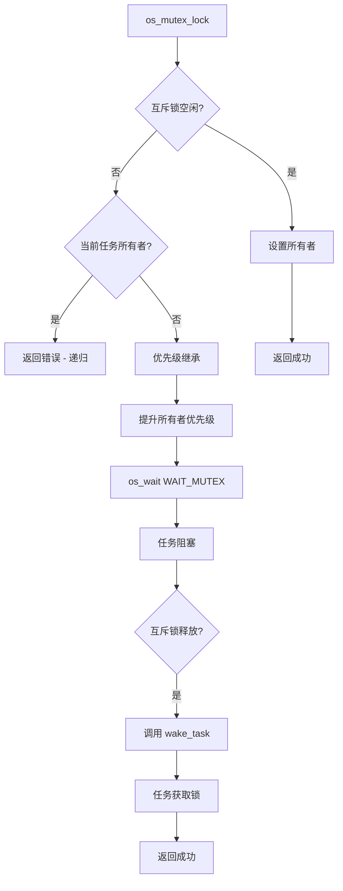
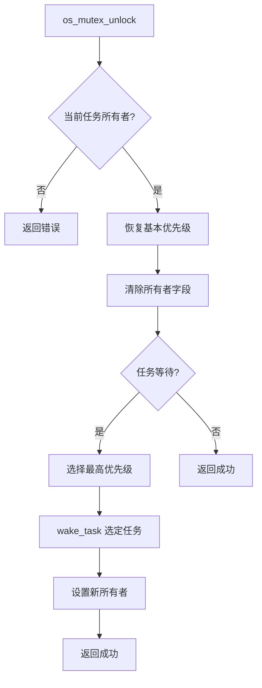
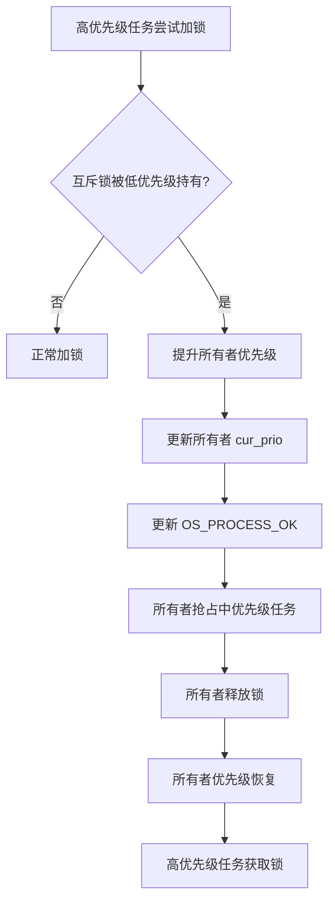

# HRTOS 互斥锁设计

## 模块介绍

互斥锁模块提供同步机制，用于保护共享资源免受并发访问。它实现优先级继承以防止优先级反转，确保多任务系统中的实时性能。

## 主要职责

互斥锁模块处理：

- 互斥锁初始化
- 互斥锁获取（加锁）
- 互斥锁释放（解锁）
- 优先级继承
- 所有者跟踪
- 等待队列管理

## 主要文件

### 源文件

- `Src/mutex/mutex_init.c`：互斥锁初始化
- `Src/mutex/mutex_lock.c`：具有优先级继承的互斥锁加锁
- `Src/mutex/mutex_unlock.c`：具有优先级恢复的互斥锁解锁

### 头文件

- `Inc/mutex.h`：互斥锁 API 声明
- `Inc/config.h`：互斥锁资源结构
- `Inc/hrtos_internal.h`：内部互斥锁变量

## 数据结构

### OS_RESOURCE（统一 IPC）

互斥锁使用统一资源结构：

```c
typedef struct {
    u8 value;           /* 互斥锁不使用 */
    u8 owner;           /* 当前所有者任务 ID */
    u8 wait_cnt;        /* 等待任务计数 */
    u16 wait_mask;      /* 位图等待队列 */
    u8 pending_signal;  /* 互斥锁不使用 */
} OS_RESOURCE;
```

对于互斥锁：
- `owner`：当前持有锁的任务 ID
- `wait_mask`：等待此互斥锁的任务位图
- `wait_cnt`：等待任务计数

## 核心函数

### os_mutex_init()

**位置**：`Src/mutex/mutex_init.c`

**目的**：初始化互斥锁对象

**参数**：
- `mid`：互斥锁资源 ID（0-7）

**返回**：成功返回 1，失败返回 -1

**过程**：
1. 验证资源 ID
2. 通过 `os_res_init()` 初始化资源结构
3. 将所有者设置为 `OS_INVALID_ID`
4. 清除等待队列

### os_mutex_lock()

**位置**：`Src/mutex/mutex_lock.c`

**目的**：获取具有优先级继承的互斥锁

**参数**：
- `mid`：互斥锁资源 ID

**返回**：
- 1：成功获取锁
- 0：进入等待队列
- -1：参数错误或递归锁尝试

**过程**：
```c
char os_mutex_lock(char mid)
{
    OS_RESOURCE *m;
    char tid;
    
    if (mid < 0 || mid >= OS_RESOURCE_MAX) return -1;
    
    tid = OS_CURRENT_TASK;
    m = &OS_RES[mid];
    EA = 0;
    
    /* 无递归锁支持 */
    if (m->owner == tid) {
        EA = 1;
        return -1;
    }
    
    /* 互斥锁空闲，直接获取 */
    if (m->owner == OS_INVALID_ID) {
        m->owner = tid;
        OS_TASK[tid].base_prio = (OS_PROCESS_OK[tid] & 14) >> 1;
        OS_TASK[tid].cur_prio = OS_TASK[tid].base_prio;
        EA = 1;
        return 1;
    }
    
    /* 优先级继承 */
    OS_TASK[tid].base_prio = (OS_PROCESS_OK[tid] & 14) >> 1;
    OS_TASK[tid].cur_prio = OS_TASK[tid].base_prio;
    
    if (OS_TASK[tid].cur_prio > OS_TASK[m->owner].cur_prio) {
        OS_TASK[m->owner].cur_prio = OS_TASK[tid].cur_prio;
        OS_PROCESS_OK[m->owner] &= 0xF1;
        OS_PROCESS_OK[m->owner] |= ((OS_TASK[tid].cur_prio & 0x07) << 1);
    }
    
    EA = 1;
    
    /* 进入等待状态 */
    os_wait(WAIT_MUTEX, mid, 0);
    return 1;
}
```

### os_mutex_unlock()

**位置**：`Src/mutex/mutex_unlock.c`

**目的**：释放互斥锁并恢复优先级

**参数**：
- `mid`：互斥锁资源 ID

**返回**：成功返回 1，失败返回 -1

**过程**：
1. 验证资源 ID
2. 检查当前任务是否为所有者
3. 将所有者的优先级恢复到基本优先级
4. 清除所有者字段
5. 唤醒最高优先级的等待任务
6. 设置新所有者（如果有任务等待）

## 调用关系

### 互斥锁加锁流程



### 互斥锁解锁流程



### 优先级继承流程



## 生命周期

### 互斥锁生命周期

1. **初始化**：`os_mutex_init()` 创建互斥锁
2. **获取**：任务调用 `os_mutex_lock()`
3. **所有权**：所有者字段设置为任务 ID
4. **竞争**：其他任务在队列中等待
5. **优先级继承**：如需要则提升所有者优先级
6. **释放**：所有者调用 `os_mutex_unlock()`
7. **优先级恢复**：所有者优先级恢复
8. **转移**：下一个等待任务获取锁

## 设计原则

### 互斥

- 一次只能有一个任务持有互斥锁
- 所有者字段跟踪当前持有者
- 无递归锁定（返回错误）

### 优先级继承

- 防止优先级反转
- 高优先级等待任务提升所有者优先级
- 解锁时恢复所有者优先级
- 确保有界阻塞时间

### 无递归锁

- 递归锁尝试返回错误
- 防止递归获取导致的死锁
- 更简单的实现

### 统一资源模型

- 使用相同的 `OS_RESOURCE` 结构
- 通过 `os_wait()` 统一等待
- 与其他 IPC 一致

## 约束

- 最多 8 个互斥锁对象
- 无递归锁定支持
- 仅优先级继承（无天花板协议）
- 必须由拥有任务解锁
- 不能在 ISR 上下文中使用
- 锁获取无超时

## 优先级继承算法

### 何时提升

在以下情况下提升优先级：
1. 互斥锁已被持有
2. 等待任务的优先级高于所有者
3. 等待任务不是所有者（递归检查）

### 提升实现

```c
if (OS_TASK[tid].cur_prio > OS_TASK[m->owner].cur_prio) {
    OS_TASK[m->owner].cur_prio = OS_TASK[tid].cur_prio;
    OS_PROCESS_OK[m->owner] &= 0xF1;
    OS_PROCESS_OK[m->owner] |= ((OS_TASK[tid].cur_prio & 0x07) << 1);
}
```

### 优先级恢复

解锁时：
1. 将所有者的 `cur_prio` 恢复到 `base_prio`
2. 用基本优先级更新 `OS_PROCESS_OK`
3. 所有者返回到原始优先级级别

## 使用模式

### 基本互斥锁保护

```c
// 共享资源
u8 shared_counter = 0;

// 任务 A
void task_a(void) {
    while (1) {
        os_mutex_lock(MUTEX_ID);
        shared_counter++;
        os_mutex_unlock(MUTEX_ID);
        os_delay(10);
    }
}

// 任务 B
void task_b(void) {
    while (1) {
        os_mutex_lock(MUTEX_ID);
        shared_counter--;
        os_mutex_unlock(MUTEX_ID);
        os_delay(10);
    }
}
```

### 优先级继承场景

```c
// 低优先级任务（优先级 2）
void low_task(void) {
    while (1) {
        os_mutex_lock(MUTEX_ID);
        // 持有锁一段时间
        process_shared_resource();
        os_mutex_unlock(MUTEX_ID);
        os_delay(100);
    }
}

// 高优先级任务（优先级 6）
void high_task(void) {
    while (1) {
        os_mutex_lock(MUTEX_ID);
        // 将 low_task 优先级提升到 6
        critical_operation();
        os_mutex_unlock(MUTEX_ID);
        os_delay(10);
    }
}

// 中优先级任务（优先级 4）
void medium_task(void) {
    while (1) {
        // 将被提升的 low_task 抢占
        background_work();
        os_delay(50);
    }
}
```

## 性能考虑

### 锁获取时间

- 快速路径：互斥锁空闲（无阻塞）
- 慢速路径：互斥锁被持有（阻塞 + 优先级提升）
- 优先级提升增加最小开销

### 上下文切换开销

- 锁阻塞导致上下文切换
- 优先级提升可能导致立即抢占
- 解锁导致唤醒和上下文切换

### 内存效率

- 互斥锁结构：5 字节（OS_RESOURCE 的一部分）
- 每个互斥锁无额外内存
- 等待队列的位图

## 与其他 IPC 的比较

### vs 信号量

- 互斥锁：所有权，优先级继承
- 信号量：计数，无所有权

### vs 二进制信号量

- 互斥锁：所有者必须解锁
- 二进制信号量：任何任务都可以释放

### vs 自旋锁

- 互斥锁：阻塞，上下文切换
- 自旋锁：忙等待（HRTOS 中未实现）

## 常见陷阱

### 死锁预防

- 始终以一致的顺序获取锁
- 保持临界区简短
- 持有锁时不要调用阻塞 API
- 不要在 ISR 中使用互斥锁

### 优先级继承限制

- 仅防止无界优先级反转
- 不防止死锁
- 可能出现优先级提升链
- 未实现优先级天花板协议
