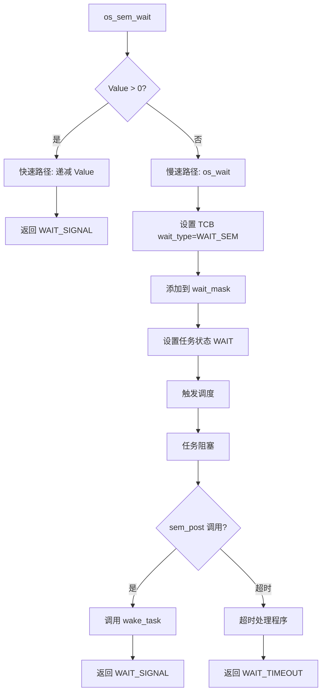
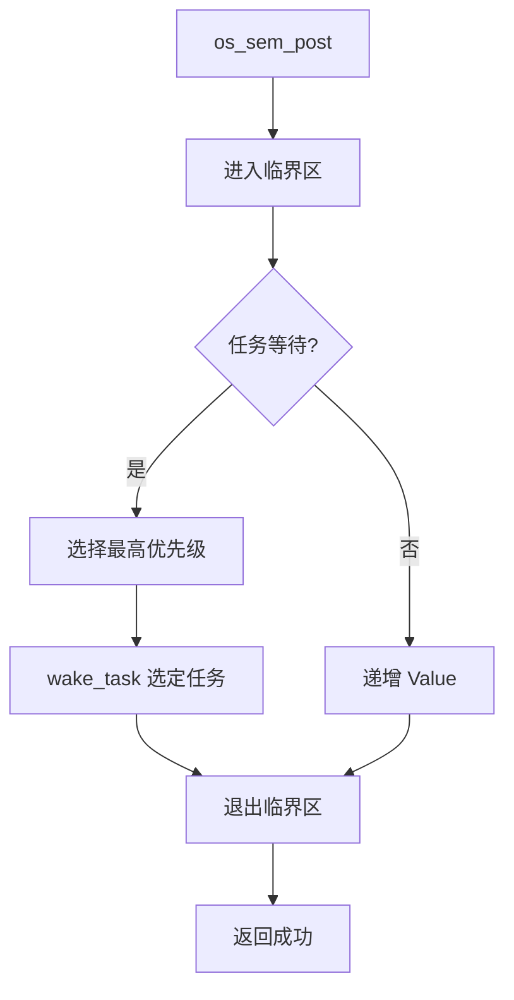
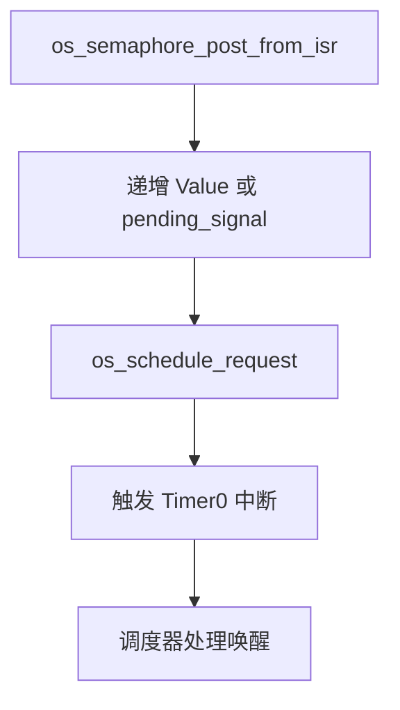

# HRTOS 信号量设计

## 模块介绍

信号量模块提供计数同步机制，用于资源管理和任务协调。它实现经典的 P（等待/获取）和 V（释放/发布）操作，支持资源计数和事件信号。

## 主要职责

信号量模块处理：

- 带初始计数的信号量初始化
- P 操作（等待/获取）
- V 操作（释放/发布）
- 资源计数
- 等待队列管理
- ISR 安全释放操作

## 主要文件

### 源文件

- `Src/semaphore/sem_init.c`：信号量初始化
- `Src/semaphore/sem_wait.c`：P 操作（等待）
- `Src/semaphore/sem_post.c`：V 操作（释放）
- `Src/interrupt/semaphore_post_from_isr.c`：ISR 安全释放

### 头文件

- `Inc/semaphore.h`：信号量 API 声明
- `Inc/config.h`：信号量资源结构
- `Inc/hrtos_internal.h`：内部信号量变量

## 数据结构

### OS_RESOURCE（统一 IPC）

信号量使用统一资源结构：

```c
typedef struct {
    u8 value;           /* 信号量计数 */
    u8 owner;           /* 信号量不使用 */
    u8 wait_cnt;        /* 等待任务计数 */
    u16 wait_mask;      /* 位图等待队列 */
    u8 pending_signal;  /* ISR 信号计数 */
} OS_RESOURCE;
```

对于信号量：
- `value`：信号量计数（0 = 无资源，>0 = 可用资源）
- `wait_mask`：等待此信号量的任务位图
- `wait_cnt`：等待任务计数

## 核心函数

### os_sem_init()

**位置**：`Src/semaphore/sem_init.c`

**目的**：使用初始计数初始化信号量

**参数**：
- `sid`：信号量资源 ID（0-7）
- `init_val`：初始计数值

**返回**：成功返回 1，失败返回 -1

**过程**：
1. 验证资源 ID
2. 通过 `os_res_init()` 初始化资源结构
3. 设置初始值
4. 清除等待队列

### os_sem_wait()

**位置**：`Src/semaphore/sem_wait.c`

**目的**：P 操作 - 获取信号量资源

**参数**：
- `sid`：信号量资源 ID

**返回**：
- `WAIT_SIGNAL`：成功获取
- 任务 ID：进入等待（唤醒后返回）
- 0：参数错误

**过程**：
```c
u8 os_sem_wait(u8 sid)
{
    OS_RESOURCE *s;
    u8 tid;
    
    if (sid >= OS_RESOURCE_MAX) return 0;
    
    EA = 0;
    s = &OS_RES[sid];
    
    if(s->value == 0) {
        EA = 1;
        tid = os_wait(WAIT_SEM, sid, 0);
    }
    
    /* 快速路径：信号量可用（无阻塞） */
    if(s->value > 0) {
        s->value--;              /* 消耗一个资源 */
        EA = 1;
        return WAIT_SIGNAL;      /* 成功 */
    }
    
    EA = 1;
    return tid;
}
```

**设计说明**：
- 快速路径优化：如果 value > 0，立即获取而不阻塞
- 慢速路径：如果 value == 0，进入等待状态
- 双通道模型：value 计数 + wait_mask 队列

### os_sem_post()

**位置**：`Src/semaphore/sem_post.c`

**目的**：V 操作 - 释放信号量资源

**参数**：
- `sid`：信号量资源 ID

**返回**：成功返回 1，失败返回 -1

**过程**：
1. 验证资源 ID
2. 进入临界区
3. 检查是否有任务等待
4. 如果有等待：唤醒最高优先级任务
5. 如果无等待：递增 value
6. 退出临界区

### os_semaphore_post_from_isr()

**位置**：`Src/interrupt/semaphore_post_from_isr.c`

**目的**：ISR 安全 V 操作

**参数**：
- `obj`：信号量资源 ID

**返回**：成功返回 1，失败返回 -1

**过程**：
1. 验证资源 ID
2. 递增 value 或设置挂起信号
3. 触发调度请求
4. 立即返回（ISR 中不阻塞）

## 调用关系

### 信号量等待流程



### 信号量释放流程



### ISR 释放流程



## 生命周期

### 信号量生命周期

1. **初始化**：`os_sem_init()` 设置初始计数
2. **获取**：任务调用 `os_sem_wait()`（P 操作）
3. **计数**：每次成功等待时 value 递减
4. **阻塞**：value 达到 0 时任务阻塞
5. **释放**：任务调用 `os_sem_post()`（V 操作）
6. **唤醒**：等待任务被唤醒
7. **重用**：信号量可以重复使用

## 设计原则

### 计数语义

- Value 表示可用资源计数
- P 操作递减（获取）
- V 操作递增（释放）
- Value 可以 >1（多个资源）

### 快速路径优化

- 进入临界区前检查 value
- 如果 value > 0，立即获取
- 避免上下文切换开销
- 对性能至关重要

### 双通道模型

- 通道 1：`value` 计数器（快速路径）
- 通道 2：`wait_mask` 队列（慢速路径）
- 互斥操作
- 防止竞争条件

### ISR 安全

- 独立的 ISR 安全释放 API
- ISR 上下文中不阻塞
- ISR 的挂起信号计数器
- 唤醒的调度请求

### 统一资源模型

- 使用相同的 `OS_RESOURCE` 结构
- 通过 `os_wait()` 统一等待
- 与其他 IPC 一致

## 约束

- 最多 8 个信号量对象
- Value 限制为 8 位（0-255）
- 等待无超时（无限等待）
- 无优先级继承
- 无所有权跟踪
- 不能用于互斥（改用互斥锁）

## 使用模式

### 资源计数

```c
// 初始化 3 个资源
os_sem_init(SEM_ID, 3);

// 任务 A
void task_a(void) {
    while (1) {
        os_sem_wait(SEM_ID);
        use_resource();
        os_sem_post(SEM_ID);
        os_delay(10);
    }
}

// 任务 B
void task_b(void) {
    while (1) {
        os_sem_wait(SEM_ID);
        use_resource();
        os_sem_post(SEM_ID);
        os_delay(10);
    }
}
```

### 二进制信号量（信号）

```c
// 初始化为二进制信号量（0 或 1）
os_sem_init(SEM_ID, 0);

// 任务 A - 生产者
void producer_task(void) {
    while (1) {
        produce_data();
        os_sem_post(SEM_ID);  // 信号
        os_delay(10);
    }
}

// 任务 B - 消费者
void consumer_task(void) {
    while (1) {
        os_sem_wait(SEM_ID);  // 等待信号
        consume_data();
    }
}
```

### ISR 信号

```c
// ISR
void external_interrupt_handler(void) {
    os_semaphore_post_from_isr(SEM_ID);
}

// 任务
void interrupt_task(void) {
    while (1) {
        os_sem_wait(SEM_ID);
        handle_interrupt_event();
    }
}
```

## 性能考虑

### 快速路径优势

- 资源可用时无上下文切换
- 无竞争情况的最小开销
- 对高频操作至关重要

### 阻塞开销

- value == 0 时上下文切换
- 释放时的唤醒开销
- 基于优先级的唤醒选择

### 内存效率

- 信号量结构：5 字节（OS_RESOURCE 的一部分）
- Value：1 字节
- 等待队列：2 字节（位图）

## 与其他 IPC 的比较

### vs 互斥锁

- 信号量：计数，无所有权
- 互斥锁：二进制，所有权，优先级继承

### vs 事件

- 信号量：计数，资源跟踪
- 事件：二进制标志，无计数

### vs 消息队列

- 信号量：计数同步
- 消息队列：带缓冲的数据传输

## 常见陷阱

### 资源泄漏

- 成功等待后始终释放
- 使用错误处理确保释放
- 不要在错误路径中忘记释放

### 优先级反转

- 信号量没有优先级继承
- 高优先级任务可能被低优先级任务阻塞
- 如果优先级反转是问题，使用互斥锁

### 过度使用

- 不要使用信号量进行互斥
- 使用互斥锁进行独占访问
- 使用信号量进行资源计数或信号
