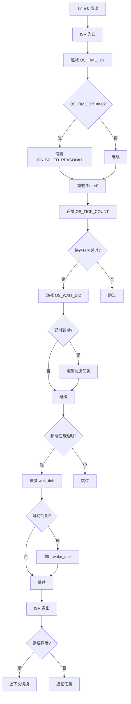
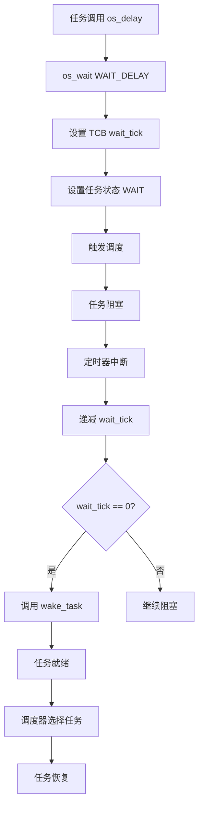

# HRTOS 定时器系统

## 模块介绍

定时器系统为 HRTOS 提供基于时间的服务，包括系统时钟生成、任务延时、时间转换工具和运行时间跟踪。它基于 8051 微控制器的 Timer0，是内核中所有时间相关操作的基础。

## 主要职责

定时器系统处理：

- 通过 Timer0 生成系统时钟
- 时间片管理
- 任务延时实现
- 时钟到时间单位的转换
- 系统运行时间跟踪
- 定时器配置

## 主要文件

### 源文件

- `Src/time/tick_config.c`：定时器配置
- `Src/time/delay.c`：基于时钟的任务延时
- `Src/time/delay_ms.c`：忙等待毫秒延时
- `Src/time/ms_to_tick.c`：毫秒到时钟周期转换
- `Src/time/sec_to_tick.c`：秒到时钟周期转换
- `Src/time/tick_get.c`：获取当前时钟周期计数
- `Src/time/uptime_ms.c`：获取系统运行时间（毫秒）

### 头文件

- `Inc/time.h`：定时器 API 声明
- `Inc/config.h`：定时器配置常量
- `Inc/hrtos_internal.h`：内部定时器变量

## 数据结构

### 定时器配置常量

位于 `Inc/config.h`：

```c
#define OS_TIME_ONCE_DEFAULT 5      // 默认时间片计数
#define OS_TIME_T0 10000            // 单个时间片长度（Timer0 计数）
```

### 内部定时器变量

位于 `Src/kernel/os_core.c`：

```c
volatile unsigned char idata OS_TIME_XY;        // 当前时间片计数器
volatile unsigned char idata OS_T0_TH0;         // Timer0 高字节
volatile unsigned char idata OS_T0_TL0;         // Timer0 低字节
volatile unsigned char xdata OS_TIME_ONCE;      // 时间片计数
volatile unsigned char xdata OS_TIME_ONCE_BACKUP; // 模式切换备份
```

### 时钟周期计数器

位于 `Inc/hrtos_internal.h`：

```c
extern unsigned int xdata OS_TICK_COUNT_L;     // 时钟周期计数低 16 位
extern unsigned int xdata OS_TICK_COUNT_H;     // 时钟周期计数高 16 位
```

### 快速任务延时计数器

```c
extern unsigned int xdata OS_WAIT_DI2[OS_FAST_TASK_MAX];  // 快速任务延时
```

## 核心函数

### os_tick_config()

**位置**：`Src/time/tick_config.c`

**目的**：配置系统定时器参数

**参数**：
- `slice_count`：每个调度周期的时间片数
- `tick_value`：每个时钟周期的 Timer0 计数值

**返回**：成功返回 1，失败返回 -1

**过程**：
1. 验证参数
2. 将 `OS_TIME_ONCE` 设置为 slice_count
3. 将 Timer0 重载值设置为 tick_value
4. 重置当前时间片计数器

### os_delay()

**位置**：`Src/time/delay.c`

**目的**：延迟当前任务指定的时钟周期数

**参数**：
- `tick`：延迟时长（时钟周期）

**过程**：
```c
void os_delay(u16 tick)
{
    if(tick != 0) {
        if(OS_CURRENT_TASK < OS_PROCESS_MAX+2) {
            os_wait(WAIT_DELAY, OS_INVALID_ID, tick);
        }
    }
}
```

**设计说明**：
- 使用统一等待机制
- 类型：`WAIT_DELAY`
- 无资源对象（使用 `OS_INVALID_ID`）
- 任务阻塞直到时钟周期到期

### os_delay_ms()

**位置**：`Src/time/delay_ms.c`

**目的**：短硬件定时的忙等待延迟

**参数**：
- `ms`：延迟（毫秒）

**特性**：
- 忙等待（不让出 CPU）
- 仅用于短硬件定时
- 不触发调度
- 需要精确定时而不进行任务切换时使用

### os_ms_to_tick()

**位置**：`Src/time/ms_to_tick.c`

**目的**：将毫秒转换为时钟周期

**参数**：
- `ms`：毫秒

**返回**：等效的时钟周期计数

**计算**：基于 `OS_TIME_T0` 和 CPU 时钟频率

### os_sec_to_tick()

**位置**：`Src/time/sec_to_tick.c`

**目的**：将秒转换为时钟周期

**参数**：
- `sec`：秒

**返回**：等效的时钟周期计数

### os_tick_get()

**位置**：`Src/time/tick_get.c`

**目的**：获取当前系统时钟周期计数

**参数**：
- `high`：存储高 16 位的指针
- `low`：存储低 16 位的指针

**过程**：
1. 进入临界区
2. 读取 `OS_TICK_COUNT_L` 和 `OS_TICK_COUNT_H`
3. 退出临界区
4. 通过指针返回值

### os_uptime_ms()

**位置**：`Src/time/uptime_ms.c`

**目的**：获取系统运行时间（毫秒）

**返回**：运行时间作为 32 位毫秒计数

**过程**：
1. 读取时钟周期计数器
2. 基于时钟周期持续时间转换为毫秒
3. 返回 32 位值

## 调用关系

### 定时器中断流程



### 任务延时流程



## 生命周期

### 定时器初始化

1. 系统启动
2. `os_idle_task()` 初始化定时器变量
3. 用户调用 `os_tick_config()`（可选）
4. Timer0 中断启用
5. 定时器开始生成时钟周期

### 时钟周期生成周期

1. Timer0 计数到溢出
2. Timer0 ISR 触发
3. 时间片计数器递减
4. 时钟周期计数器递增
5. 检查并递减任务延时
6. 如需要则触发调度
7. 重载 Timer0
8. ISR 退出

### 任务延时生命周期

1. 任务调用 `os_delay(tick)`
2. `wait_tick` 设置为 tick 值
3. 任务进入 WAIT 状态
4. 每个时钟周期中断递减 `wait_tick`
5. 当 `wait_tick` 达到 0 时，任务唤醒
6. 任务返回到 READY 状态
7. 调度器选择任务运行

## 设计原则

### 基于 Timer0

- 使用 8051 Timer0 生成时钟周期
- 可配置的时钟周期持续时间
- 硬件中断驱动
- 最小 CPU 开销

### 时间片调度

- `OS_TIME_ONCE`：每个调度周期的时间片数
- `OS_TIME_XY`：当前时间片计数器
- 当计数器达到 0 时触发调度
- 支持时间片和纯优先级模式

### 统一等待

- 延时使用相同的 `os_wait()` 机制
- 延时使用 `WAIT_DELAY` 类型
- 与 IPC 等待一致
- 简化实现

### 快速任务独立定时

- 快速任务使用 `OS_WAIT_DI2` 数组
- 独立于标准任务延时
- 快速任务的最小开销
- 快速任务无 TCB wait_tick

### 32 位时钟周期计数器

- 32 位总时钟周期计数（16+16 位）
- 支持长运行时间
- 在合理时间内防止溢出
- 通过临界区原子访问

## 约束

- 所有定时使用单个定时器（Timer0）
- 配置后时钟周期持续时间固定
- 最大延时受限于 16 位 wait_tick
- 无高分辨率定时器
- 无定时器回调机制
- 忙等待延迟仅用于短持续时间

## 定时器配置

### 默认配置

```c
#define OS_TIME_ONCE_DEFAULT 5      // 每周期 5 个时间片
#define OS_TIME_T0 10000            // Timer0 计数值
```

### 自定义配置

```c
// 配置 10ms 时钟周期，每周期 10 个时间片
os_tick_config(10, 10000);
```

### 时钟周期持续时间计算

时钟周期持续时间取决于：
- CPU 时钟频率
- Timer0 预分频器（如果有）
- Timer0 重载值

12MHz CPU 示例：
- Timer0 以 1MHz 计数（12/12）
- 重载值 10000 = 10ms 时钟周期
- 10 个时间片 = 100ms 调度周期

## 使用模式

### 基本任务延时

```c
void periodic_task(void) {
    while (1) {
        do_work();
        os_delay(100);  // 延迟 100 个时钟周期
    }
}
```

### 毫秒转换

```c
void task_with_ms_delay(void) {
    u16 ticks = os_ms_to_tick(500);  // 500ms
    while (1) {
        do_work();
        os_delay(ticks);
    }
}
```

### 运行时间跟踪

```c
void monitor_task(void) {
    u32 uptime;
    while (1) {
        uptime = os_uptime_ms();
        display_uptime(uptime);
        os_delay(1000);
    }
}
```

### 硬件忙等待

```c
void init_hardware(void) {
    // 硬件稳定的短延迟
    os_delay_ms(10);
}
```

## 性能考虑

### 中断开销

- 定时器中断频率决定开销
- 更高频率 = 更精确的定时，更多开销
- 在精度和 CPU 负载之间平衡

### 延迟精度

- 时钟周期粒度决定最小延迟
- 不能延迟少于一个时钟周期
- 使用 `os_delay_ms()` 获得亚时钟周期精度（忙等待）

### 上下文切换开销

- 任务延时导致上下文切换
- 唤醒需要调度
- 多个任务同时到期导致多次唤醒

## 与其他 RTOS 定时器的比较

### vs 硬件定时器

- HRTOS：单个系统定时器，软件延时
- 硬件定时器：多个独立定时器，硬件事件

### vs 虚拟定时器

- HRTOS：无虚拟定时器回调
- 虚拟定时器：每个任务的定时器回调

### vs 高分辨率定时器

- HRTOS：基于时钟周期，分辨率有限
- 高分辨率：微秒/纳秒精度
