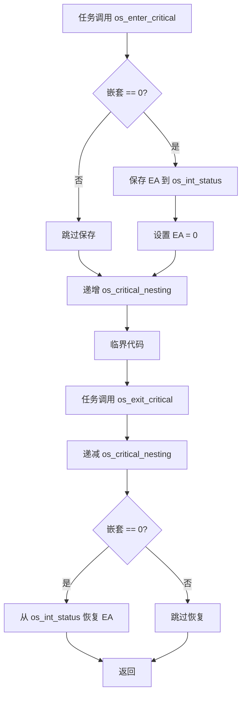
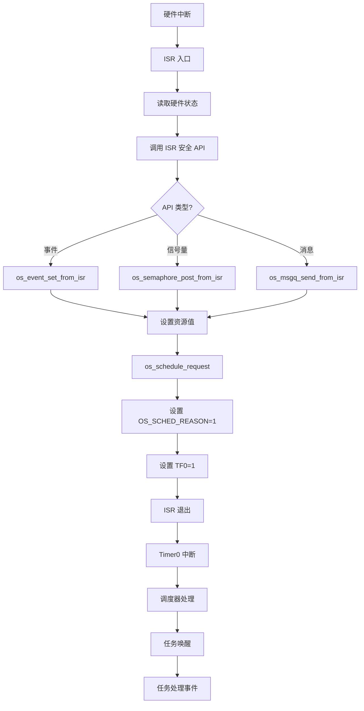

# HRTOS 中断设计

## 模块介绍

中断模块为 HRTOS 提供中断管理服务，包括临界区保护、ISR 上下文检测和进程间通信的 ISR 安全 API。它确保中断处理程序和内核调度器之间的安全交互。

## 主要职责

中断模块处理：

- 临界区管理（进入/退出）
- ISR 上下文检测
- ISR 安全 IPC 操作
- 中断 ID 识别
- 来自 ISR 的调度请求
- 中断嵌套支持

## 主要文件

### 源文件

- `Src/interrupt/enter_critical.c`：进入临界区
- `Src/interrupt/exit_critical.c`：退出临界区
- `Src/interrupt/in_isr.c`：检查 ISR 上下文
- `Src/interrupt/interrupt_id.c`：获取中断 ID
- `Src/interrupt/schedule_request.c`：从 ISR 请求调度
- `Src/interrupt/event_set_from_isr.c`：ISR 安全的事件设置
- `Src/interrupt/msgq_send_from_isr.c`：ISR 安全的消息发送
- `Src/interrupt/msgq_recv_from_isr.c`：ISR 安全的消息接收
- `Src/interrupt/queue_send_from_isr.c`：ISR 安全的队列发送（遗留）
- `Src/interrupt/semaphore_post_from_isr.c`：ISR 安全的信号量释放

### 头文件

- `Inc/interrupt.h`：中断 API 声明
- `Inc/config.h`：临界区宏
- `Inc/hrtos_internal.h`：内部中断变量

## 数据结构

### 临界区变量

位于 `Inc/hrtos_internal.h`：

```c
extern bit os_int_status;              // 进入时保存的中断状态
extern unsigned char idata os_critical_nesting;  // 嵌套计数器
```

### 中断控制变量

位于 `Src/kernel/os_core.c`：

```c
volatile bit OS_ISR_FLAG;              // ISR 发生标志
volatile bit OS_INTERRUPT_GAO;         // 高优先级中断标志
volatile bit OS_INTERRUPT_GAO_BIAO;    // 高优先级中断指示器
volatile unsigned char data OS_INTERRUPT_PROTECT;  // 中断 ID 保护
volatile unsigned char data OS_INT_BAO[6];  // 中断上下文保存（ACC、B、DPH、DPL、PSW、EA）
```

### 中断地址向量

```c
volatile unsigned char xdata OS_INTERRUPT_ADDR[2];   // 中断处理程序地址
volatile unsigned char xdata OS_INTERRUPT_ADDR2[2];  // 嵌套中断处理程序地址
```

## 核心函数

### os_enter_critical()

**位置**：`Src/interrupt/enter_critical.c`

**目的**：进入临界区（禁用中断）

**过程**：
```c
void os_enter_critical()
{
    if(os_critical_nesting == 0) {
        os_int_status = EA;      // 保存当前中断状态
        EA = 0;                  // 禁用中断
    }
    os_critical_nesting++;       // 递增嵌套计数器
}
```

**设计说明**：
- 支持嵌套临界区
- 仅在首次进入时禁用中断
- 在最终退出时恢复原始状态
- 防止中断重入问题

### os_exit_critical()

**位置**：`Src/interrupt/exit_critical.c`

**目的**：退出临界区（恢复中断）

**过程**：
```c
void os_exit_critical()
{
    os_critical_nesting--;       // 递减嵌套计数器
    if(os_critical_nesting == 0) {
        EA = os_int_status;      // 恢复中断状态
    }
}
```

**设计说明**：
- 仅在嵌套达到 0 时启用中断
- 恢复原始中断状态
- 对嵌套临界区安全

### os_in_isr()

**位置**：`Src/interrupt/in_isr.c`

**目的**：检查当前是否在 ISR 上下文中执行

**返回**：
- 1：在 ISR 上下文中
- 0：在任务上下文中

**实现**：检查内部 ISR 标志

### os_interrupt_id()

**位置**：`Src/interrupt/interrupt_id.c`

**目的**：获取当前中断 ID

**返回**：中断号（0、2-31，基于自然进入顺序）

**实现**：读取中断向量或内部保护寄存器

### os_schedule_request()

**位置**：`Src/interrupt/schedule_request.c`

**目的**：从 ISR 请求任务重新调度

**参数**：
- `id`：保留参数

**返回**：成功返回 1

**过程**：
```c
char os_schedule_request(char id)
{
    id = id;                    // 保留供将来使用
    OS_SCHED_REASON = 1;        // 设置调度触发标志
    TF0 = 1;                    // 触发 Timer0 中断
    return 1;
}
```

**设计说明**：
- 不直接调用调度器
- 通过 Timer0 中断触发调度
- 对 ISR 上下文安全
- 确保调度在安全点发生

### ISR 安全 IPC 函数

#### os_event_set_from_isr()

**位置**：`Src/interrupt/event_set_from_isr.c`

**目的**：从 ISR 设置事件标志

**参数**：
- `id`：事件资源 ID

**返回**：成功返回 1，失败返回 -1

**过程**：
1. 验证资源 ID
2. 设置事件值
3. 递增挂起信号计数器
4. 调用 `os_schedule_request()`

#### os_semaphore_post_from_isr()

**位置**：`Src/interrupt/semaphore_post_from_isr.c`

**目的**：从 ISR 释放信号量

**参数**：
- `obj`：信号量资源 ID

**返回**：成功返回 1，失败返回 -1

**过程**：
1. 验证资源 ID
2. 递增信号量值或挂起信号
3. 调用 `os_schedule_request()`

#### os_msgq_send_from_isr()

**位置**：`Src/interrupt/msgq_send_from_isr.c`

**目的**：从 ISR 发送消息

**参数**：
- `q`：队列指针
- `obj`：资源 ID
- `_data`：消息数据

**返回**：成功返回 1，失败返回 0（队列已满）

**过程**：
1. 检查队列是否已满
2. 如果已满，返回失败（ISR 中不阻塞）
3. 写入数据到队列
4. 更新队列指针
5. 调用 `os_schedule_request()`

## 调用关系

### 临界区流程



### ISR 到任务通知流程



## 生命周期

### 临界区生命周期

1. **进入**：调用 `os_enter_critical()`
2. **嵌套检查**：如果是首次进入，保存中断状态
3. **禁用**：设置 `EA = 0`（如果是首次进入）
4. **递增**：增加嵌套计数器
5. **临界代码**：执行受保护代码
6. **退出**：调用 `os_exit_critical()`
7. **递减**：减少嵌套计数器
8. **恢复**：如果嵌套达到 0，恢复中断状态

### ISR 执行生命周期

1. **中断**：发生硬件中断
2. **上下文保存**：硬件保存上下文
3. **ISR 入口**：ISR 执行
4. **ISR 安全 API**：可能调用 ISR 安全函数
5. **调度请求**：可能请求重新调度
6. **ISR 退出**：ISR 返回
7. **上下文恢复**：硬件恢复上下文
8. **调度**：如果请求，调度器运行

## 设计原则

### 嵌套临界区

- 支持嵌套临界区
- 嵌套计数器跟踪深度
- 仅在首次进入时禁用
- 仅在最终退出时启用
- 防止过早启用中断

### ISR 安全

- 独立的 ISR 安全 API
- ISR 中无阻塞操作
- 调度请求而非直接调度
- 最小 ISR 执行时间

### 延迟调度

- ISR 不直接调用调度器
- 使用 Timer0 中断作为安全点
- 防止重入问题
- 确保状态一致

### 临界区宏

```c
#define OS_ENTER_CRITICAL()   do{ os_enter_critical(); }while(0)
#define OS_EXIT_CRITICAL()    do{ os_exit_critical(); }while(0)
```

- 安全的宏包装
- Do-while(0) 用于正确的语句分组
- 一致的 API 使用

## 约束

- 最大嵌套深度受限于 8 位计数器
- ISR 不能调用阻塞 API
- ISR 不能使用互斥锁
- ISR 必须简短（无复杂逻辑）
- 仅通过 Timer0 进行调度请求
- 内核中无中断优先级配置

## ISR 规则

### ISR 中允许

- 读取硬件寄存器
- 设置事件标志
- 释放信号量
- 发送消息（非阻塞）
- 设置简单状态标志
- 调用 `os_schedule_request()`

### ISR 中禁止

- 调用阻塞 API（`os_delay`、`os_wait` 等）
- 使用互斥锁
- 接收消息
- 长时间计算
- 动态内存分配
- 递归调用内核

### ISR 设计模式

```c
void example_isr(void) interrupt VECTOR
{
    // 1. 读取硬件状态（最小化）
    u8 status = HW_STATUS_REG;
    
    // 2. 清除中断源
    HW_CLEAR_REG = status;
    
    // 3. 通知任务（ISR 安全 API）
    if (status & EVENT_FLAG) {
        os_event_set_from_isr(EVENT_ID);
    }
    
    // 4. 快速退出
}
```

## 性能考虑

### 临界区开销

- 最小开销（保存/恢复 EA）
- 嵌套增加小的计数器递增/递减
- 临界区中无上下文切换

### ISR 延迟

- 临界区增加 ISR 延迟
- 保持临界区简短
- 嵌套增加最大延迟
- 在保护和响应性之间平衡

### 调度请求开销

- 用于调度的 Timer0 中断
- 调度器运行前的小延迟
- 安全但不立即
- 对大多数应用可接受

## 中断优先级级别

### 8051 中断优先级

HRTOS 使用 8051 的自然中断优先级：
- 外部中断 0（最高）
- Timer0
- 外部中断 1
- Timer1
- 串行口（最低）

### 内核中断级别

```c
/* 调度级别定义：
* 0-7   普通任务优先级
* 8     高优先级任务
* 9     中断级
* 10    中断嵌套级
*/
#define OS_SCHED_LEVEL_MAX 10
```

- 优先级 9：中断处理程序任务
- 优先级 10：嵌套中断处理程序
- 高于标准和快速任务

## 与其他 RTOS 的比较

### vs 嵌套中断

- HRTOS：有限的嵌套支持
- 其他 RTOS：完全的嵌套中断支持

### vs 中断锁定

- HRTOS：临界区（禁用所有中断）
- 其他 RTOS：中断屏蔽（选择性禁用）

### vs ISR 延迟处理

- HRTOS：基于 Timer0 的延迟调度
- 其他 RTOS：软件中断或直接调度
