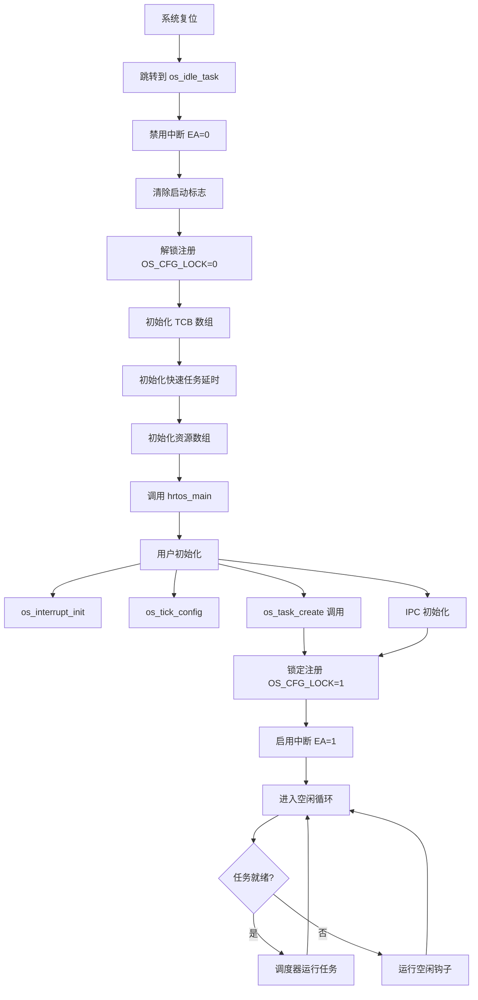
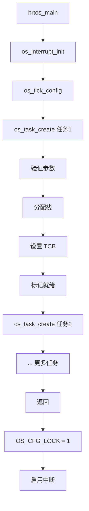

# HRTOS 内核启动

## 模块介绍

内核启动是从上电或复位初始化 HRTOS 系统直到调度器运行和任务执行的过程。本文档描述了完整的初始化序列以及从硬件复位到完全运行的 RTOS 的转换。

## 主要职责

内核启动处理：

- 硬件初始化
- 内存初始化
- 内核数据结构初始化
- 任务注册
- 中断配置
- 调度器激活
- 转换到空闲任务

## 主要文件

### 源文件

- `Src/kernel/idle_task.c`：空闲任务和系统入口点
- `Src/kernel/os_data.c`：DATA 段初始化
- `Src/kernel/os_xdata.c`：XDATA 段初始化
- `Src/kernel/task_create.c`：任务注册
- `Src/kernel/scheduler.c`：调度器配置

### 头文件

- `Inc/kernel.h`：内核初始化 API
- `Inc/hrtos_internal.h`：内部启动变量

## 数据结构

### 启动状态变量

位于 `Src/kernel/os_core.c`：

```c
volatile bit OS_RTOS_YES;               /* RTOS 模式标志 */
volatile bit OS_CFG_LOCK;               /* 注册锁定 */
volatile bit OS_SCHED_REASON;           /* 调度触发 */
```

### 空闲钩子

```c
void (*g_idle_hook)(void);              /* 空闲钩子函数指针 */
```

## 核心函数

### os_idle_task()

**位置**：`Src/kernel/idle_task.c`

**目的**：系统入口点和空闲任务

**过程**：
```c
void os_idle_task(void)
{
    u8 i;
    EA = 0;                              // 禁用中断
    g_idle_hook = 0;                     // 清除空闲钩子
    OS_SCHED_REASON = 0;                 // 清除调度触发
    OS_CFG_LOCK = 0;                     // 允许注册
    
    // 初始化 TCB 数组
    for(i = 1; i < OS_PROCESS_MAX; i++)
    {
        OS_TASK[i].wait_type = WAIT_NONE;
        OS_TASK[i].state = DEAD;
        OS_TASK[i].wait_tick = 0;
    }
    
    // 初始化快速任务延时
    OS_WAIT_DI2[0] = 0;
    OS_WAIT_DI2[1] = 0;
    
    // 初始化资源数组
    for(i = 0; i < OS_RESOURCE_MAX; i++)
    {
        OS_RES[i].value = 0;
        OS_RES[i].owner = OS_INVALID_ID;
        OS_RES[i].wait_cnt = 0;
        OS_RES[i].wait_mask = 0;
        OS_RES[i].pending_signal = 0;
    }
    
    hrtos_main();                        // 用户初始化
    
    OS_CFG_LOCK = 1;                     // 锁定注册
    EA = 1;                              // 启用中断
    
    // 空闲循环
    while(1)
    {
        EA = 0;
        for(i = 1; i < OS_TASK_TOTAL; i++)
        {
            if(OS_TASK_EVENT[i] & OS_EVENT_DELETE_REQ)
            {
                OS_TASK_EVENT[i] &= ~OS_EVENT_DELETE_REQ;
                os_task_cleanup(i);
            }
        }
        EA = 1;
        if (g_idle_hook)
        {
            g_idle_hook();
        }
    }
}
```

### hrtos_main()

**位置**：用户定义（内核中的弱引用）

**目的**：用户定义的初始化函数

**职责**：
- 调用 `os_interrupt_init()` 配置中断
- 调用 `os_tick_config()` 配置定时器
- 通过 `os_task_create()` 创建任务
- 初始化 IPC 对象（事件、信号量等）
- 如需要设置空闲钩子

**示例**：
```c
void hrtos_main(void)
{
    os_interrupt_init();
    os_tick_config(OS_TIME_ONCE_DEFAULT, OS_TIME_T0);
    
    os_task_create((unsigned int)task1, 1, 4, 5);
    os_task_create((unsigned int)task2, 2, 3, 5);
    
    os_event_init(0);
    os_sem_init(1, 1);
}
```

### os_interrupt_init()

**位置**：实现取决于移植

**目的**：初始化中断系统

**过程**：
1. 配置中断优先级
2. 设置中断向量
3. 启用所需中断
4. 配置 Timer0 用于系统时钟

### os_idle_hook_register()

**位置**：`Src/kernel/idle_hook_register.c`

**目的**：注册空闲钩子函数

**参数**：
- `hook`：在空闲循环中调用的函数指针

## 调用关系

### 启动序列



### 启动期间的任务注册



## 生命周期

### 阶段 1：硬件复位

1. **复位**：发生硬件复位
2. **向量获取**：CPU 获取复位向量
3. **跳转**：跳转到 `os_idle_task()`
4. **栈设置**：硬件设置初始栈

### 阶段 2：内核初始化

1. **中断禁用**：`EA = 0` 确保初始化期间无中断
2. **标志清除**：清除所有启动标志
3. **注册解锁**：`OS_CFG_LOCK = 0` 允许任务创建
4. **TCB 初始化**：将所有 TCB 初始化为 DEAD 状态
5. **资源初始化**：初始化所有 IPC 资源
6. **快速任务初始化**：清除快速任务延时计数器

### 阶段 3：用户初始化

1. **hrtos_main()**：调用用户初始化函数
2. **中断初始化**：配置中断系统
3. **定时器配置**：配置 Timer0 用于系统时钟
4. **任务创建**：创建应用程序任务
5. **IPC 初始化**：初始化事件、信号量等
6. **返回**：用户初始化完成

### 阶段 4：调度器激活

1. **注册锁定**：`OS_CFG_LOCK = 1` 防止新任务
2. **中断启用**：`EA = 1` 启用中断
3. **定时器启动**：Timer0 开始生成时钟周期
4. **首次时钟**：Timer0 ISR 触发首次调度
5. **任务选择**：调度器选择最高优先级的就绪任务
6. **上下文切换**：第一个任务开始执行

### 阶段 5：运行时

1. **空闲循环**：`os_idle_task()` 进入空闲循环
2. **任务清理**：检查删除请求
3. **空闲钩子**：如果存在则调用注册的空闲钩子
4. **调度**：Timer0 中断触发调度
5. **任务执行**：任务基于优先级运行

## 设计原则

### 两阶段初始化

- **阶段 1**：内核初始化（中断禁用）
- **阶段 2**：用户初始化（中断仍禁用）
- **阶段 3**：调度器激活（中断启用）

这确保：
- 初始化期间无竞争条件
- 干净的初始化状态
- 可预测的启动序列

### 注册锁定

- `hrtos_main()` 期间 `OS_CFG_LOCK = 0`
- 用户初始化后 `OS_CFG_LOCK = 1`
- 防止运行时动态任务创建
- 简化内存管理

### 空闲任务作为入口

- `os_idle_task()` 是实际入口点
- 处理初始化和空闲循环
- 提供清理机制
- 允许空闲钩子用于电源管理

### 初始化期间的临界区

- 整个初始化期间禁用中断
- 防止过早调度
- 确保状态一致
- 对内存初始化安全

## 启动配置

### 默认配置

```c
#define OS_TIME_ONCE_DEFAULT 5      // 默认时间片
#define OS_TIME_T0 10000            // Timer0 重载值
```

### 自定义配置

用户可以在 `hrtos_main()` 中覆盖：

```c
void hrtos_main(void)
{
    os_interrupt_init();
    os_tick_config(10, 5000);  // 自定义配置
    // ...
}
```

## 空闲钩子

### 目的

空闲钩子允许用户代码在没有任务就绪时执行。常见用途：

- 电源管理（睡眠模式）
- 后台统计信息收集
- 看门狗喂狗
- 低优先级维护

### 注册

```c
void my_idle_hook(void)
{
    // 自定义空闲处理
}

void hrtos_main(void)
{
    os_idle_hook_register(my_idle_hook);
    // ...
}
```

## 约束

- 任务创建仅允许在 `hrtos_main()` 期间
- 启动后无动态任务创建
- 初始化期间必须禁用中断
- `hrtos_main()` 不得阻塞或延时
- 空闲钩子必须简短且非阻塞

## 启动时间考虑

### 初始化开销

- TCB 初始化：O(OS_PROCESS_MAX)
- 资源初始化：O(OS_RESOURCE_MAX)
- 任务创建：O(task_count)
- 总启动时间：通常 < 1ms

### 首次任务选择

- 调度器扫描所有任务
- 选择最高优先级的就绪任务
- 上下文切换开销
- 首次时钟可能延迟

## 错误处理

### 启动失败

- **栈溢出**：如果严重越界则系统复位
- **任务创建失败**：返回 -1，检查返回值
- **资源耗尽**：返回 -1，检查返回值
- **中断初始化失败**：可能导致系统挂起

### 恢复

- 栈溢出触发系统复位
- 任务创建错误应在 `hrtos_main()` 中处理
- 大多数错误无自动恢复

## 调试启动

### 常见问题

1. **系统挂起**：检查是否启用中断
2. **无任务执行**：验证任务创建成功
3. **错误任务运行**：检查优先级设置
4. **栈溢出**：减少栈大小或任务数量

### 调试技术

- 在 `hrtos_main()` 中添加断点
- 检查任务创建返回值
- 验证定时器配置
- 监视中断标志
