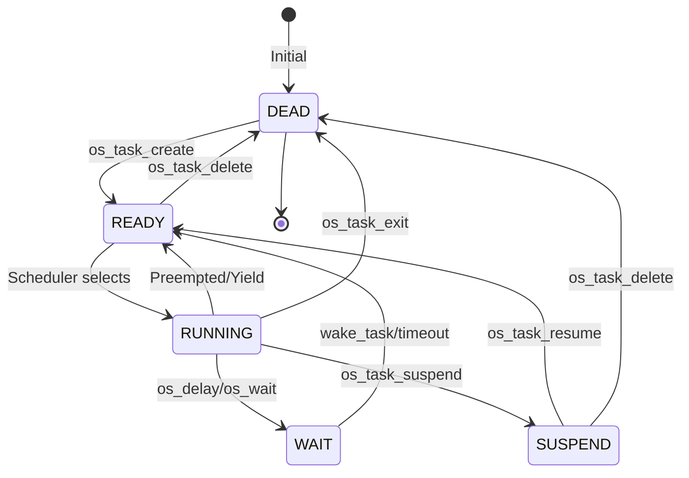
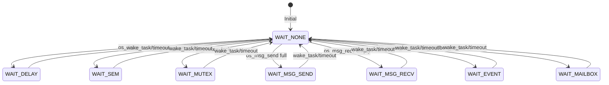
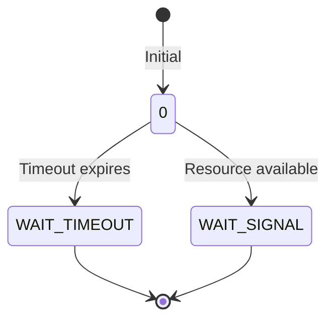
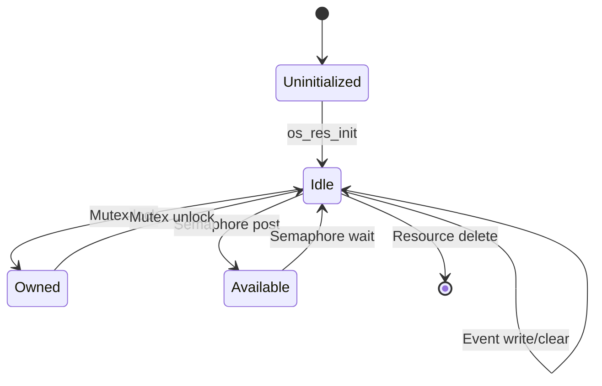
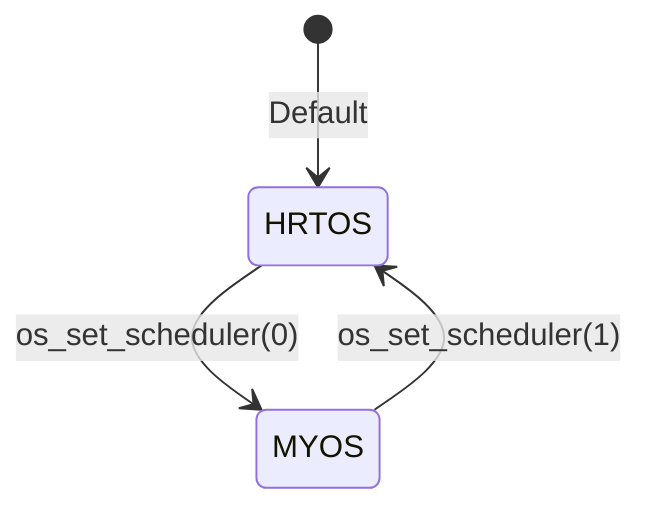

# HRTOS 状态机

## 模块介绍

HRTOS 使用状态机来管理任务状态、IPC 资源状态和系统模式。本文档描述 HRTOS 中的各种状态机、它们的转换以及触发状态更改的事件。

## 主要职责

状态机处理：

- 任务生命周期状态
- IPC 资源状态
- 等待状态类型
- 系统模式状态
- 调度原因状态

## 主要文件

### 源文件

- `Src/task/task_state.c`：任务状态查询
- `Src/wait/os_wait.c`：等待状态管理
- `Src/wait/wake_task.c`：唤醒时的状态转换
- `Src/kernel/scheduler.c`：调度器模式状态

### 头文件

- `Inc/config.h`：状态定义和常量
- `Inc/hrtos_internal.h`：内部状态变量

## 数据结构

### 任务状态

位于 `Inc/config.h`：

```c
#define READY         0   /* 就绪态 */
#define WAIT          1   /* 等待态 */
#define RUNNING       2   /* 运行态 */
#define SUSPEND       3   /* 挂起态 */
#define DEAD          4   /* 删除态 */
```

### 等待类型

```c
#define WAIT_NONE      0   /* 无等待 */
#define WAIT_DELAY     1   /* 延时等待 */
#define WAIT_SEM       2   /* 信号量等待 */
#define WAIT_MUTEX     3   /* 互斥锁等待 */
#define WAIT_MSG_SEND  4   /* 消息队列发送等待（队列满） */
#define WAIT_MSG_RECV  5   /* 消息队列接收等待（队列空） */
#define WAIT_EVENT     6   /* 事件等待 */
#define WAIT_MAILBOX   7   /* 邮箱等待 */
```

### 等待标志

```c
#define WAIT_TIMEOUT  1   /* 超时唤醒 */
#define WAIT_SIGNAL   2   /* 信号唤醒 */
```

### TCB 状态字段

```c
typedef struct {
    u8 state;           /* 任务状态 */
    u8 wait_type;       /* 等待类型 */
    u8 wait_flag;       /* 等待结果标志 */
    u8 wait_obj;        /* 等待对象 ID */
    u16 wait_tick;      /* 超时时钟周期 */
} OS_TCB;
```

## 核心状态机

### 任务状态机

#### 状态图



#### 状态描述

**DEAD（删除态）**
- 任务不存在或已被删除
- 无栈分配
- 不参与调度
- 所有任务的初始状态

**READY（就绪态）**
- 任务准备运行
- 栈已分配
- 等待调度器选择
- `OS_PROCESS_OK` 中设置就绪位

**RUNNING（运行态）**
- 任务当前正在执行
- `OS_CURRENT_TASK == task_id`
- 拥有 CPU 控制
- 可能随时被抢占

**WAIT（等待态）**
- 任务在 IPC 或延时上阻塞
- 等待资源或超时
- 不参与调度
- `OS_PROCESS_OK` 中清除就绪位

**SUSPEND（挂起态）**
- 任务被显式挂起
- 不参与调度
- 可以恢复到就绪状态
- `OS_PROCESS_OK` 中清除就绪位

#### 状态转换

| 从 | 到 | 触发 | 函数 |
|------|-----|---------|----------|
| DEAD | READY | `os_task_create()` | 任务创建 |
| READY | RUNNING | 调度器 | 任务被选中 |
| RUNNING | READY | 抢占/让出 | 更高优先级任务或 `os_task_yield()` |
| RUNNING | WAIT | `os_delay()`/`os_wait()` | 阻塞操作 |
| RUNNING | SUSPEND | `os_task_suspend()` | 显式挂起 |
| RUNNING | DEAD | `os_task_exit()` | 任务退出 |
| WAIT | READY | `wake_task()` | 资源可用 |
| WAIT | READY | 超时 | 定时器时钟周期到期 |
| SUSPEND | READY | `os_task_resume()` | 恢复任务 |
| READY | DEAD | `os_task_delete()` | 删除任务 |
| SUSPEND | DEAD | `os_task_delete()` | 删除挂起任务 |

### 等待类型状态机

#### 等待类型图



#### 等待类型描述

**WAIT_NONE（无等待）**
- 任务未等待
- 正常执行状态
- 可以被调度

**WAIT_DELAY（延时等待）**
- 等待时间过去
- `wait_tick` 倒计时
- 无资源对象
- 超时时自动唤醒

**WAIT_SEM（信号量等待）**
- 等待信号量
- `wait_obj` = 信号量 ID
- 在 `os_sem_post()` 时唤醒
- 超时时唤醒

**WAIT_MUTEX（互斥锁等待）**
- 等待互斥锁
- `wait_obj` = 互斥锁 ID
- 优先级继承激活
- 在 `os_mutex_unlock()` 时唤醒

**WAIT_MSG_SEND（消息发送等待）**
- 等待队列空间
- `wait_obj` = 队列资源 ID
- 空间可用时唤醒
- 超时时唤醒

**WAIT_MSG_RECV（消息接收等待）**
- 等待消息
- `wait_obj` = 队列资源 ID
- 消息可用时唤醒
- 超时时唤醒

**WAIT_EVENT（事件等待）**
- 等待事件标志
- `wait_obj` = 事件 ID
- 在 `os_event_write()` 时唤醒
- 超时时唤醒

**WAIT_MAILBOX（邮箱等待）**
- 等待邮箱数据
- `wait_obj` = 邮箱 ID
- 数据可用时唤醒
- 超时时唤醒

### 等待标志状态机

#### 等待标志图



#### 等待标志描述

**0（初始）**
- 尚未唤醒
- 任务仍在等待

**WAIT_TIMEOUT（超时唤醒）**
- 由于超时而唤醒
- `wait_tick` 达到 0
- 资源不可用

**WAIT_SIGNAL（信号唤醒）**
- 由于资源而唤醒
- 资源变为可用
- 未达到超时

### 资源状态机

#### 资源状态图



#### 资源状态描述

**Uninitialized**
- 资源未初始化
- 无法使用

**Idle**
- 资源已初始化但未使用
- 无所有者（对于互斥锁）
- 值可能为 0 或非零

**Owned（仅互斥锁）**
- 互斥锁被任务持有
- 所有者字段设置为任务 ID
- 其他任务可能等待

**Available（仅信号量）**
- 信号量有可用资源
- 值 > 0
- 任务可以无需等待获取

### 调度器模式状态机

#### 调度器模式图



#### 模式描述

**HRTOS 模式**
- 基于优先级的调度
- 时间片支持
- 互斥锁优先级继承
- 默认模式

**MYOS 模式**
- 替代调度算法
- 基于时间片
- 无优先级继承
- 遗留模式

## 状态转换函数

### wake_task()

**位置**：`Src/wait/wake_task.c`

**目的**：将任务从 WAIT 转换到 READY

**过程**：
```c
void wake_task(u8 tid, u8 flag)
{
    u8 obj;
    obj = OS_TASK[tid].wait_obj;
    
    // 清除等待掩码
    if(obj != OS_INVALID_ID)
    {
        OS_RES[obj].wait_mask &= ~((u16)1 << tid);
        if(OS_RES[obj].wait_cnt)
        {
            OS_RES[obj].wait_cnt--;
        }
    }
    
    // 设置唤醒结果
    OS_TASK[tid].wait_flag = flag;
    
    // 清除等待上下文
    OS_TASK[tid].wait_type = WAIT_NONE;
    OS_TASK[tid].wait_obj = OS_INVALID_ID;
    OS_TASK[tid].wait_tick = 0;
    
    // 设置就绪状态
    OS_TASK[tid].state = READY;
    
    // 允许调度
    OS_PROCESS_OK[tid] |= 1;
    OS_SCHED_REASON = 1;
    TF0 = 1;
}
```

### os_wait()

**位置**：`Src/wait/os_wait.c`

**目的**：将任务从 READY/RUNNING 转换到 WAIT

**过程**：
1. 设置 TCB 等待字段
2. 添加到资源等待队列
3. 将任务状态设置为 WAIT
4. 清除就绪位
5. 触发调度

## 状态查询

### os_task_get_state()

**位置**：`Src/task/task_state.c`

**目的**：查询任务状态

**返回**：
- 0：已删除
- 1：运行中
- 2：就绪
- 3：挂起
- 4：之前切换出

## 设计原则

### 状态一致性

- 所有状态更改在临界区中
- 原子状态转换
- 无中间无效状态

### 状态封装

- 状态存储在 TCB 中
- 仅通过函数访问
- 内部状态不暴露

### 确定性转换

- 每个转换都有清晰的触发
- 无自发状态更改
- 可预测的转换

## 约束

- 任务不能同时处于多个状态
- 等待类型和等待标志必须一致
- 状态转换必须是原子的
- 无直接状态操作（使用函数）

## 状态机调试

### 常见问题

1. **任务卡在 WAIT**：检查唤醒机制
2. **无效状态转换**：检查临界区
3. **状态不一致**：检查并发访问
4. **缺少唤醒**：检查资源操作

### 调试技术

- 监视 TCB 状态字段
- 跟踪状态转换
- 检查 wait_mask 一致性
- 验证调度器触发
