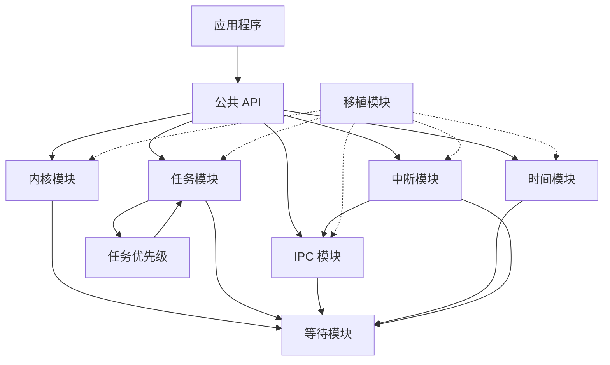

# HRTOS 模块依赖

## 模块介绍

HRTOS 由多个相互连接的模块组成。理解这些模块之间的依赖关系对于维护、调试和扩展内核至关重要。本文档描述了所有 HRTOS 模块之间的依赖关系。

## 主要职责

模块依赖描述：

- 哪些模块依赖于哪些
- 避免循环依赖
- 分层架构
- 初始化顺序
- API 使用边界

## 主要文件

### 模块结构

```
Src/
├── kernel/          （核心内核 - 不依赖于其他 Src 模块）
├── wait/            （等待机制 - 被大多数模块使用）
├── task/            （任务管理 - 依赖于 wait、task_priority）
├── task_priority/   （优先级管理 - 依赖于 task）
├── event/           （事件 - 依赖于 wait）
├── mutex/           （互斥锁 - 依赖于 wait）
├── semaphore/       （信号量 - 依赖于 wait）
├── mailbox/         （邮箱 - 依赖于 wait）
├── msgq/            （消息队列 - 依赖于 wait）
├── time/            （时间 - 依赖于 wait）
├── interrupt/       （中断 - 依赖于 event、msgq、semaphore）
└── port/            （移植 - 无依赖）
```

## 依赖图

### 高级依赖图



### 详细模块依赖

#### 内核模块

**依赖**：
- 等待模块（用于任务清理）
- 任务模块（用于任务操作）
- 中断模块（用于调度）

**被依赖**：
- 所有其他模块（通过初始化）
- 应用程序代码

**特性**：
- 具有最小依赖的核心模块
- 提供基本服务
- 首先初始化

#### 等待模块

**依赖**：
- 无（自包含）

**被依赖**：
- 任务模块
- 事件模块
- 互斥锁模块
- 信号量模块
- 邮箱模块
- 消息队列模块
- 时间模块
- 内核模块

**特性**：
- 中央等待机制
- 被所有阻塞操作使用
- 无循环依赖

#### 任务模块

**依赖**：
- 等待模块（用于阻塞操作）
- 任务优先级模块（用于优先级管理）

**被依赖**：
- 内核模块
- 应用程序代码

**特性**：
- 依赖于 wait 进行状态转换
- 依赖于 priority 进行优先级更改
- 核心功能

#### 任务优先级模块

**依赖**：
- 任务模块（用于任务操作）

**被依赖**：
- 任务模块（通过设计解决循环依赖）

**特性**：
- 与任务模块紧密耦合
- 管理优先级锁定
- 无其他依赖

#### 事件模块

**依赖**：
- 等待模块（用于事件等待）

**被依赖**：
- 中断模块（用于 ISR 安全操作）
- 应用程序代码

**特性**：
- 对 wait 的简单依赖
- 中断模块中的 ISR 安全版本

#### 互斥锁模块

**依赖**：
- 等待模块（用于互斥锁等待）

**被依赖**：
- 应用程序代码

**特性**：
- 依赖于 wait 进行阻塞
- 实现优先级继承
- 无 ISR 操作

#### 信号量模块

**依赖**：
- 等待模块（用于信号量等待）

**被依赖**：
- 中断模块（用于 ISR 安全操作）
- 应用程序代码

**特性**：
- 依赖于 wait 进行阻塞
- 中断模块中的 ISR 安全版本

#### 邮箱模块

**依赖**：
- 等待模块（用于邮箱等待）

**被依赖**：
- 应用程序代码

**特性**：
- 对 wait 的简单依赖
- 无 ISR 操作

#### 消息队列模块

**依赖**：
- 等待模块（用于队列操作）

**被依赖**：
- 中断模块（用于 ISR 安全操作）
- 应用程序代码

**特性**：
- 依赖于 wait 进行阻塞
- 中断模块中的 ISR 安全版本

#### 时间模块

**依赖**：
- 等待模块（用于延时操作）

**被依赖**：
- 应用程序代码

**特性**：
- 依赖于 wait 进行任务延时
- 定时器配置独立

#### 中断模块

**依赖**：
- 事件模块（用于 ISR 安全事件设置）
- 消息队列模块（用于 ISR 安全发送）
- 信号量模块（用于 ISR 安全释放）
- 等待模块（用于调度请求）

**被依赖**：
- 应用程序代码
- 内核模块（用于调度）

**特性**：
- 依赖于多个 IPC 模块
- 提供 ISR 安全包装器
- 无循环依赖

#### 移植模块

**依赖**：
- 无

**被依赖**：
- 所有模块（通过硬件抽象）

**特性**：
- 硬件抽象层
- 可选依赖
- 平台特定

## 依赖规则

### 无循环依赖

HRTOS 通过以下方式避免循环依赖：

1. **分层架构**：清晰的分层防止循环
2. **中央等待模块**：所有阻塞通过 wait
3. **ISR 分离**：ISR 安全函数在单独模块中
4. **优先级模块**：紧密耦合但设计为避免循环

### 依赖方向

依赖单向流动：

```
移植（底层）
    ↑
等待
    ↑
内核、任务、IPC、时间、中断
    ↑
应用程序（顶层）
```

### 初始化顺序

基于依赖关系，初始化顺序：

1. **移植**：硬件设置
2. **内核**：核心结构
3. **等待**：等待机制
4. **任务**：任务管理
5. **任务优先级**：优先级系统
6. **IPC 模块**：事件、信号量等
7. **时间**：定时器系统
8. **中断**：ISR 包装器

## 模块接口依赖

### 头文件依赖

```
hrtos.h（主入口）
    ├── config.h
    ├── wait.h
    ├── event.h
    ├── interrupt.h
    ├── kernel.h
    ├── mailbox.h
    ├── mutex.h
    ├── task.h
    ├── semaphore.h
    ├── msgq.h
    └── time.h

hrtos_internal.h（仅内核）
    └── hrtos.h
```

### 源文件依赖

所有源文件包含 `hrtos_internal.h`，它包含 `hrtos.h`。

## API 使用依赖

### 任务模块 API 被...使用

- **内核**：`os_task_create()`、`os_task_cleanup()`
- **应用程序**：所有任务 API

### 等待模块 API 被...使用

- **任务**：`os_wait()`（通过延时间接）
- **事件**：`os_wait()` 用于事件等待
- **互斥锁**：`os_wait()` 用于互斥锁等待
- **信号量**：`os_wait()` 用于信号量等待
- **邮箱**：`os_wait()` 用于邮箱接收
- **消息队列**：`os_wait()` 用于队列操作
- **时间**：`os_wait()` 用于延时

### 中断模块 API 被...使用

- **应用程序**：ISR 安全 API
- **内核**：`os_schedule_request()`

## 依赖约束

### 编译时依赖

- 所有模块必须能够访问 `hrtos_internal.h`
- 没有内核头文件任何模块都无法编译
- 对于某些目标可能排除移植模块

### 运行时依赖

- 等待模块必须在任何阻塞操作之前初始化
- 内核必须在任务创建之前初始化
- 中断模块必须在 ISR 使用之前初始化

### 内存依赖

- XDATA 池由所有模块共享
- 栈空间由所有任务共享
- 上下文保存区域预分配

## 依赖管理

### 添加新模块

添加新模块时：

1. **放置在适当的层**：不要破坏依赖方向
2. **使用 wait 进行阻塞**：如果需要阻塞，使用 wait 模块
3. **如需要添加 ISR 包装器**：将 ISR 安全函数放在中断模块中
4. **更新初始化**：如需要添加到启动序列
5. **记录依赖**：更新本文档

### 移除依赖

要减少依赖：

1. **使用回调**：代替直接调用
2. **抽象接口**：定义清晰的接口
3. **分离关注点**：如需要拆分模块
4. **移除循环依赖**：如果存在循环则重新设计

## 依赖分析工具

### 手动分析

- 检查 `#include` 语句
- 跟踪函数调用
- 分析数据结构使用

### 依赖检查

- 验证无循环包含
- 检查初始化顺序
- 验证 API 使用

## 常见依赖问题

### 循环依赖

**症状**：编译错误或无限循环

**解决方案**：
- 重新设计模块结构
- 引入中间模块
- 使用回调代替直接调用

### 缺少依赖

**症状**：链接器错误或未定义引用

**解决方案**：
- 添加缺少的包含
- 链接所需模块
- 检查模块配置

### 初始化顺序

**症状**：启动时系统挂起或崩溃

**解决方案**：
- 验证初始化序列
- 检查依赖顺序
- 如需要添加显式初始化

## 依赖最佳实践

1. **最小化依赖**：保持模块依赖最小
2. **清晰接口**：定义清晰的模块边界
3. **分层设计**：维护分层架构
4. **记录依赖**：保持文档更新
5. **避免耦合**：最小化模块之间的紧密耦合
6. **使用抽象**：抽象硬件和平台细节
