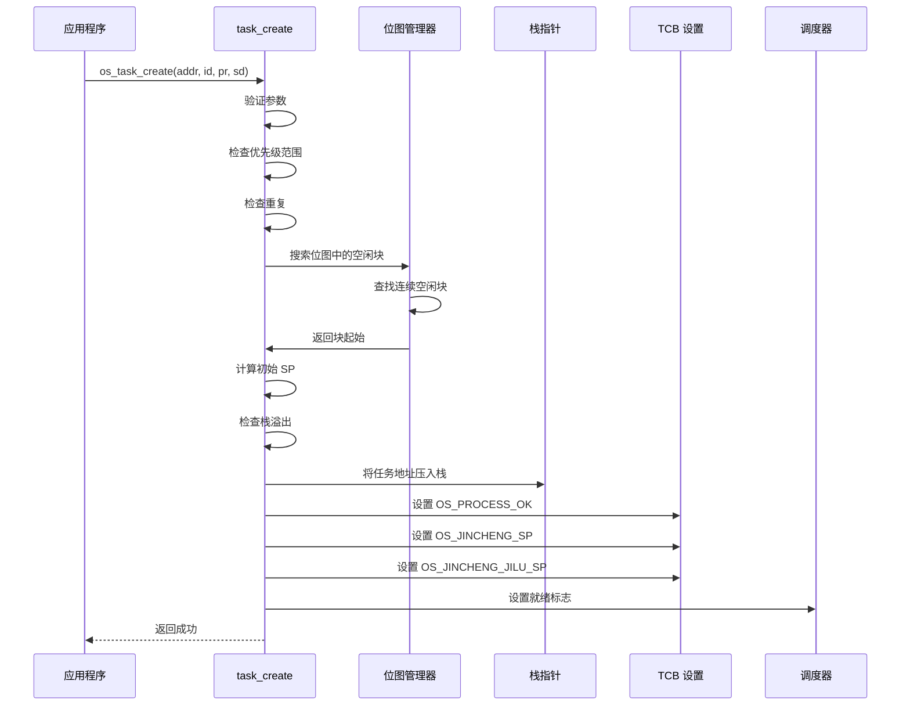
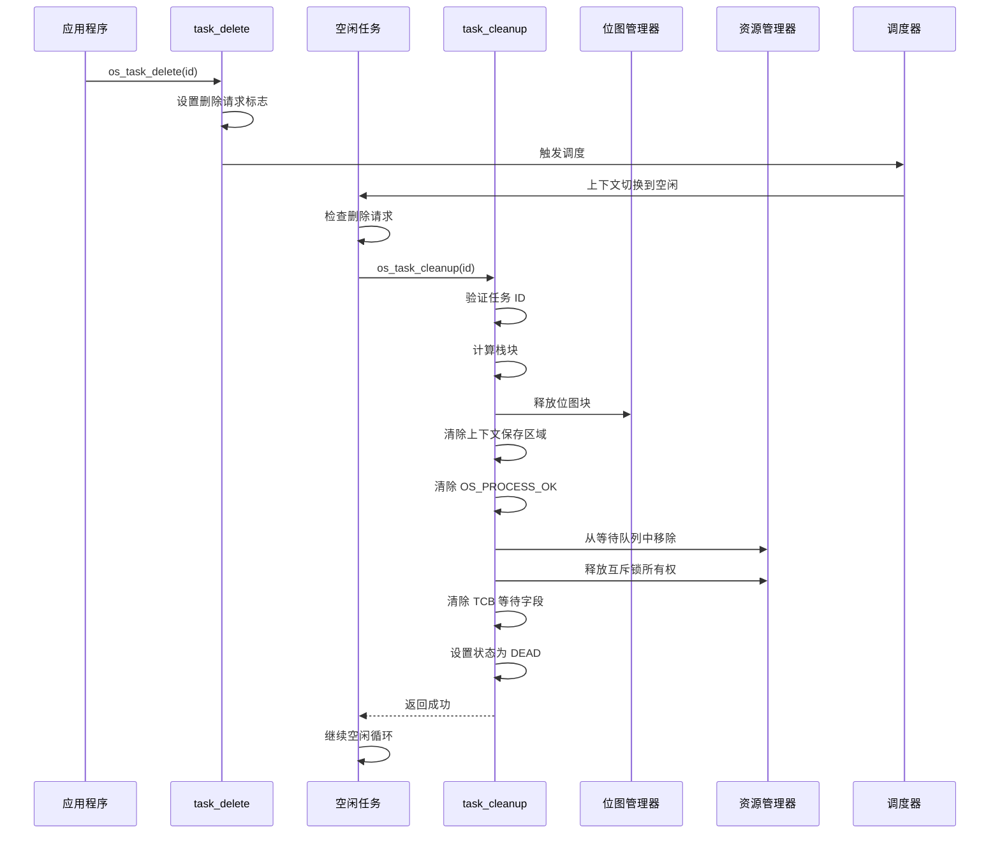
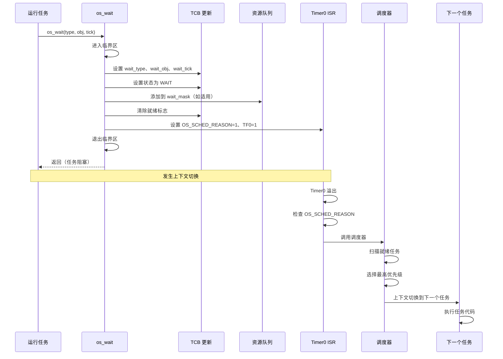
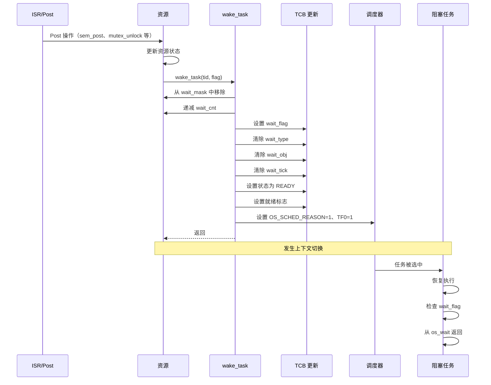
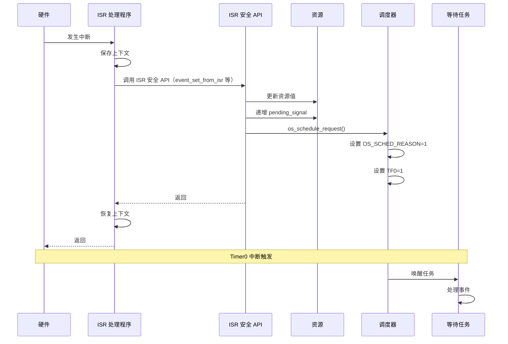
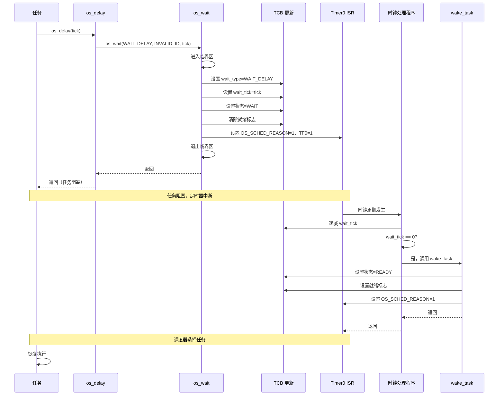
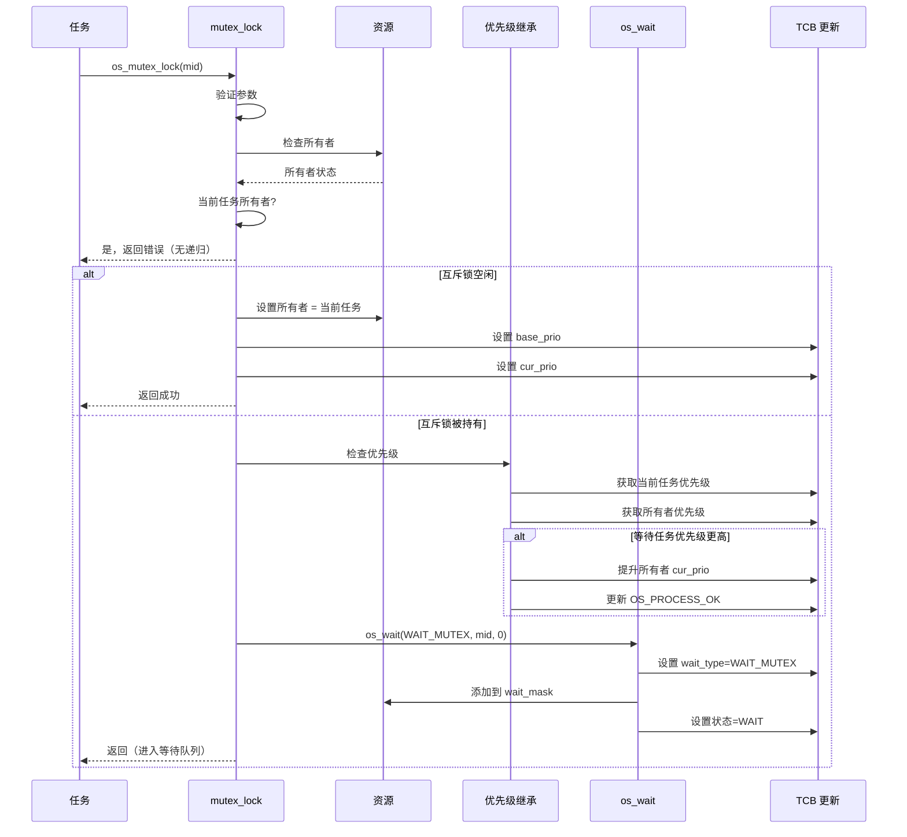
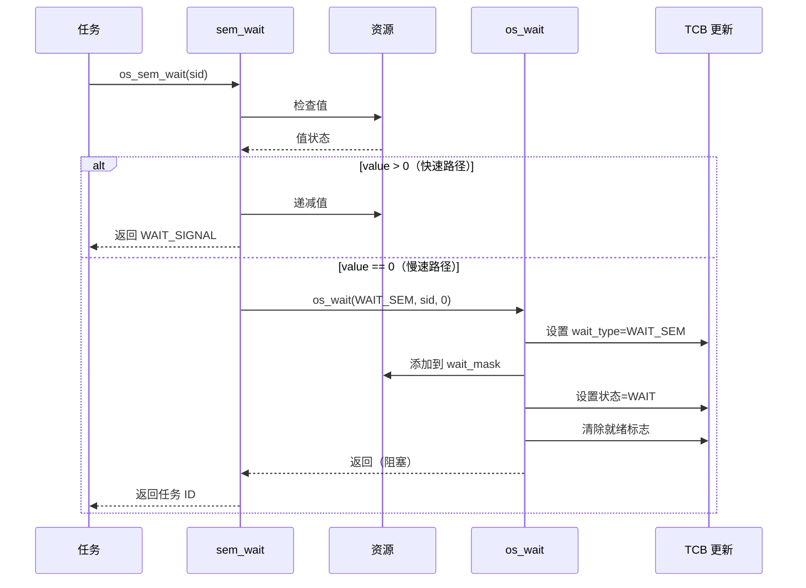
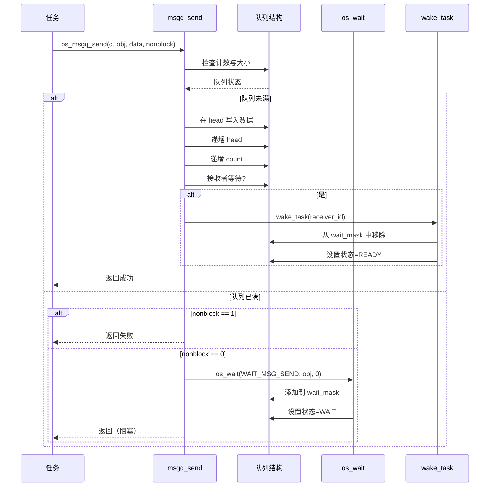

# HRTOS 调用流程

## 模块介绍

调用流程描述了 HRTOS 中的执行路径，展示了函数在各种操作期间如何相互调用。理解调用流程对于调试、性能分析和系统理解至关重要。

## 主要职责

调用流程文档涵盖：

- 任务创建和删除流程
- 调度和上下文切换流程
- IPC 操作流程
- 中断处理流程
- 定时器和延时流程

## 主要文件

### 关键流程文件

- `Src/kernel/task_create.c`：任务创建流程
- `Src/kernel/task_cleanup.c`：任务清理流程
- `Src/wait/os_wait.c`：等待流程
- `Src/wait/wake_task.c`：唤醒流程
- `Src/interrupt/schedule_request.c`：调度触发流程
- `Src/kernel/scheduler.c`：调度器选择流程

## 任务创建流程

### 完整流程图

### 详细步骤

1. **参数验证**
   - 检查优先级范围（0-10）
   - 检查任务 ID 有效性
   - 检查地址不为 NULL
   - 检查重复注册

2. **栈分配**
   - 搜索位图中的空闲块
   - 查找匹配大小的连续块
   - 在位图中标记块为已使用
   - 计算初始栈指针

3. **栈初始化**
   - 保存当前 SP
   - 将 SP 设置为任务栈
   - 压入任务地址（低字节）
   - 压入任务地址（高字节）
   - 恢复 SP

4. **TCB 设置**
   - 在 `OS_PROCESS_OK` 中设置优先级
   - 设置就绪标志
   - 记录栈指针
   - 记录初始栈指针
   - 对于快速任务：设置上下文和标志

5. **完成**
   - 返回成功（1）
   - 任务现在准备好调度

## 任务删除流程

### 完整流程图

### 详细步骤

1. **删除请求**
   - 设置 `OS_EVENT_DELETE_REQ` 标志
   - 触发调度
   - 任务继续直到被抢占

2. **空闲任务检测**
   - 空闲任务扫描删除请求
   - 为每个请求调用 `os_task_cleanup()`

3. **栈释放**
   - 计算栈块位置
   - 清除位图中的位
   - 释放栈空间

4. **上下文清理**
   - 清除上下文保存区域
   - 清除栈指针
   - 清除任务状态

5. **资源清理**
   - 从所有等待队列中移除
   - 释放互斥锁所有权
   - 清除挂起操作

6. **TCB 清理**
   - 清除 wait_type
   - 清除 wait_flag
   - 清除 wait_obj
   - 清除 wait_tick
   - 设置状态为 DEAD

## 调度流程

### 完整流程图

### 详细步骤

1. **阻塞操作**
   - 任务调用阻塞 API
   - API 调用 `os_wait()`
   - 进入临界区

2. **等待设置**
   - 设置 TCB 等待字段
   - 添加到资源等待队列
   - 设置任务状态为 WAIT
   - 清除就绪标志

3. **调度触发**
   - 设置 `OS_SCHED_REASON = 1`
   - 设置 `TF0 = 1`（触发 Timer0）
   - 退出临界区

4. **上下文切换**
   - Timer0 ISR 触发
   - 调度器扫描任务
   - 选择最高优先级的就绪任务
   - 发生上下文切换

5. **任务执行**
   - 下一个任务运行
   - 前一个任务阻塞

## 唤醒流程

### 完整流程图

### 详细步骤

1. **资源操作**
   - ISR 或任务执行 post 操作
   - 资源状态更新
   - 识别等待任务

2. **唤醒任务调用**
   - 调用 `wake_task(tid, flag)`
   - 临界区保护

3. **队列清理**
   - 从 wait_mask 中移除任务
   - 递减 wait_cnt
   - 清除资源关联

4. **TCB 更新**
   - 设置 wait_flag（TIMEOUT 或 SIGNAL）
   - 清除 wait_type
   - 清除 wait_obj
   - 清除 wait_tick
   - 设置状态为 READY
   - 在 `OS_PROCESS_OK` 中设置就绪标志

5. **调度触发**
   - 设置 `OS_SCHED_REASON = 1`
   - 设置 `TF0 = 1`
   - 任务将被调度

## 中断处理流程

### 完整流程图

### 详细步骤

1. **中断入口**
   - 发生硬件中断
   - 硬件保存上下文
   - ISR 处理程序执行

2. **ISR 安全 API 调用**
   - 事件设置、信号量释放或消息发送
   - 资源值更新
   - 挂起信号递增

3. **调度请求**
   - 调用 `os_schedule_request()`
   - 设置调度触发
   - 触发 Timer0 中断

4. **ISR 退出**
   - 上下文恢复
   - 从中断返回

5. **延迟调度**
   - Timer0 中断触发
   - 调度器处理唤醒
   - 任务恢复

## 延时流程

### 完整流程图

### 详细步骤

1. **延时调用**
   - 任务调用 `os_delay(tick)`
   - 调用 `os_wait(WAIT_DELAY, INVALID_ID, tick)`

2. **等待设置**
   - 设置 wait_type 为 WAIT_DELAY
   - 设置 wait_tick 为 tick 值
   - 无资源对象（INVALID_ID）
   - 设置状态为 WAIT
   - 清除就绪标志

3. **调度触发**
   - 设置调度触发
   - 任务阻塞

4. **时钟周期处理**
   - 每次 Timer0 中断
   - 递减 wait_tick
   - 检查 wait_tick == 0

5. **唤醒**
   - 当 wait_tick 达到 0
   - 使用 WAIT_TIMEOUT 调用 `wake_task()`
   - 任务返回到 READY 状态

6. **任务恢复**
   - 调度器选择任务
   - 任务恢复执行
   - 从 `os_delay()` 返回

## 互斥锁加锁流程

### 完整流程图

### 详细步骤

1. **加锁请求**
   - 任务调用 `os_mutex_lock(mid)`
   - 验证互斥锁 ID

2. **递归检查**
   - 检查当前任务是否为所有者
   - 如果是，返回错误（无递归锁）

3. **空闲互斥锁**
   - 如果互斥锁空闲（所有者 = INVALID_ID）
   - 将所有者设置为当前任务
   - 设置任务优先级
   - 立即返回成功

4. **被持有的互斥锁**
   - 如果互斥锁被另一个任务持有
   - 检查优先级继承
   - 如果等待任务优先级更高：
     - 提升所有者优先级
     - 更新所有者的 `OS_PROCESS_OK`
   - 调用 `os_wait(WAIT_MUTEX, mid, 0)`
   - 添加到等待队列
   - 返回（任务阻塞）

## 信号量等待流程

### 完整流程图

### 详细步骤

1. **信号量等待**
   - 任务调用 `os_sem_wait(sid)`
   - 进入临界区

2. **快速路径检查**
   - 检查 value > 0
   - 如果是：
     - 递减值
     - 立即返回 WAIT_SIGNAL
     - 无阻塞，无上下文切换

3. **慢速路径**
   - 如果 value == 0
   - 调用 `os_wait(WAIT_SEM, sid, 0)`
   - 设置 wait_type
   - 添加到 wait_mask
   - 设置状态为 WAIT
   - 任务阻塞

4. **唤醒**
   - 当调用 `os_sem_post()` 时
   - 使用 WAIT_SIGNAL 唤醒任务
   - 从 `os_sem_wait()` 返回

## 消息队列发送流程

### 完整流程图

### 详细步骤

1. **发送请求**
   - 任务调用 `os_msgq_send()`
   - 检查队列状态

2. **队列未满**
   - 在 head 处将数据写入缓冲区
   - 递增 head（带环绕）
   - 递增 count
   - 检查接收者是否等待
   - 如果是，唤醒接收者
   - 返回成功

3. **队列已满**
   - 检查 nonblock 标志
   - 如果非阻塞：返回失败
   - 如果阻塞：
     - 调用 `os_wait(WAIT_MSG_SEND, obj, 0)`
     - 添加到发送者等待队列
     - 任务阻塞

4. **唤醒**
   - 当接收者消费消息时
   - 空间变为可用
   - 发送者被唤醒
   - 发送操作完成

## 调用流程摘要

### 常见模式

1. **阻塞操作**：所有阻塞操作通过 `os_wait()`
2. **唤醒**：所有唤醒通过 `wake_task()`
3. **调度**：通过 Timer0 中断触发调度
4. **临界区**：所有状态更改由临界区保护

### 性能考虑

- **快速路径**：许多操作具有快速路径优化
- **上下文切换**：阻塞操作导致上下文切换
- **临界区**：临界区中的时间最小
- **ISR 安全**：ISR 操作延迟到任务上下文

### 调试调用流程

- **跟踪函数调用**：在关键函数处添加断点
- **监视状态**：观察 TCB 和资源状态更改
- **检查触发**：验证调度触发
- **验证转换**：确保状态转换正确
